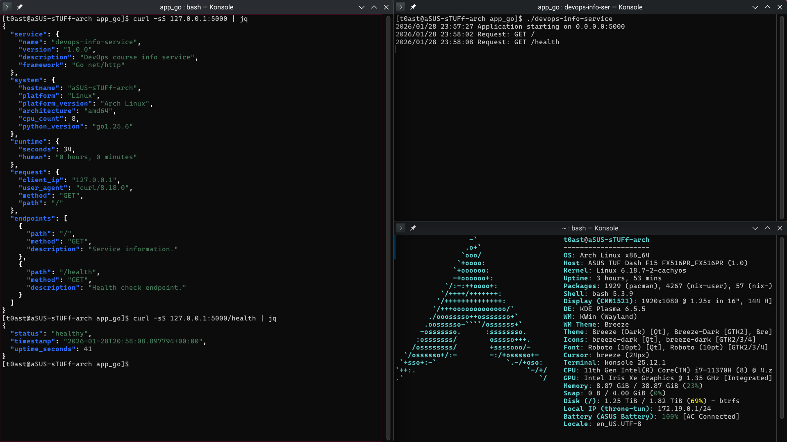

# LAB01 — DevOps Info Service (Go)

## Implementation Overview

This Go version mirrors the Python service and exposes the same two endpoints using the standard `net/http` package.

### Endpoints

- `GET /` returns service, system, runtime, request info, and a list of endpoints.
- `GET /health` returns a health status, timestamp, and uptime in seconds.

### Runtime Behavior

- **Uptime:** computed from a `startTime` set at process start.
- **System info:** hostname via `os.Hostname`, OS/arch via `runtime`.
- **Request info:** client IP from `X-Forwarded-For` or `RemoteAddr`.
- **Errors:** JSON 404 for unknown paths and JSON 500 on panics (recovery middleware).

## Build & Run

```bash
go build -o devops-info-service.out .
./devops-info-service.out
# Custom config
HOST=127.0.0.1 PORT=8080 ./devops-info-service.out
```

## API Examples

```bash
curl -sS http://127.0.0.1:5000/ | jq
curl -sS http://127.0.0.1:5000/health | jq
```

## Notes

- `python_version` in the JSON is populated with the Go runtime version to keep the output shape identical to the Python app.
- The advertised endpoint list is a static slice to match the Python output.

## Screenshot

