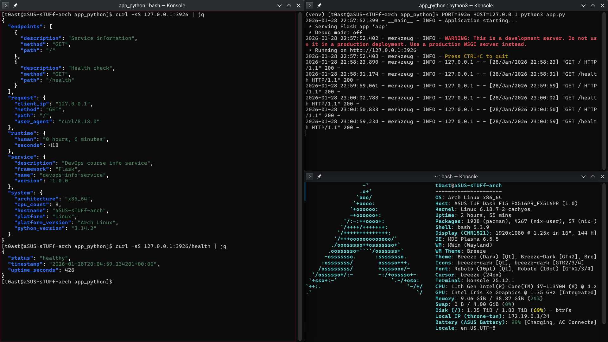

# LAB01 - DevOps Info Service (Python)

## Framework Selection

**Choice:** Flask
**Why:** I did not know any Python web framework for APIs, and Flask felt simplest to start with. Most lab examples were in Flask, so it reduced friction.

**Comparison (concise):**

| Framework      | Pros                                 | Cons                           | Fit for this lab                          |
| -------------- | ------------------------------------ | ------------------------------ | ----------------------------------------- |
| Flask (chosen) | Minimal, easy to learn, flexible     | Fewer batteries included       | Best for a small info service             |
| FastAPI        | Great typing, auto docs, async ready | Slightly more concepts upfront | Good, but extra overhead for a simple lab |
| Django         | Full stack, ORM, auth                | Heavy for a tiny API           | Overkill here                             |

## Best Practices Applied

Below are concrete examples from `app.py` and why they matter.

1. **Configuration via env vars** - makes the service configurable without code changes.

```python
HOST = os.getenv("HOST", "0.0.0.0")
PORT = int(os.getenv("PORT", 5000))
DEBUG = os.getenv("DEBUG", "False").lower() == "true"
```

2. **Clear separation into helper functions** - keeps endpoints small and readable.

```python
def get_system_info() -> dict[str, str | int]:
    ...

def get_uptime():
    ...
```

3. **Logging** - provides startup and request diagnostics.

```python
logging.basicConfig(
    level=logging.INFO,
    format="%(asctime)s - %(name)s - %(levelname)s - %(message)s"
)
logger.info("Application starting...")
```

4. **Error handling** - consistent JSON errors for clients.

```python
@app.errorhandler(404)
def not_found(error):
    return jsonify({"error": "Not Found", "message": "Endpoint does not exist"}), 404
```

## API Documentation

### Endpoints

- `GET /` - service + system + runtime + request info
- `GET /health` - health check

### Example Requests

```bash
curl -sS http://127.0.0.1:5000/ | jq
curl -sS http://127.0.0.1:5000/health | jq
```

### Example Responses

`GET /`:

```json
{
  "endpoints": [
    {
      "description": "Service information",
      "method": "GET",
      "path": "/"
    },
    {
      "description": "Health check",
      "method": "GET",
      "path": "/health"
    }
  ],
  "request": {
    "client_ip": "127.0.0.1",
    "method": "GET",
    "path": "/",
    "user_agent": "curl/8.18.0"
  },
  "runtime": {
    "human": "0 hours, 6 minutes",
    "seconds": 418
  },
  "service": {
    "description": "DevOps course info service",
    "framework": "Flask",
    "name": "devops-info-service",
    "version": "1.0.0"
  },
  "system": {
    "architecture": "x86_64",
    "cpu_count": 8,
    "hostname": "aSUS-sTUFf-arch",
    "platform": "Linux",
    "platform_version": "Arch Linux",
    "python_version": "3.14.2"
  }
}
```

`GET /health`:

```json
{
  "status": "healthy",
  "timestamp": "2026-01-28T20:04:59.234201+00:00",
  "uptime_seconds": 426
}
```

## Testing Evidence

### Screenshot



### Output

```js
$ curl -sS 127.0.0.1:3926 | jq
{
  "endpoints": [
    {
      "description": "Service information",
      "method": "GET",
      "path": "/"
    },
    {
      "description": "Health check",
      "method": "GET",
      "path": "/health"
    }
  ],
  "request": {
    "client_ip": "127.0.0.1",
    "method": "GET",
    "path": "/",
    "user_agent": "curl/8.18.0"
  },
  "runtime": {
    "human": "0 hours, 6 minutes",
    "seconds": 418
  },
  "service": {
    "description": "DevOps course info service",
    "framework": "Flask",
    "name": "devops-info-service",
    "version": "1.0.0"
  },
  "system": {
    "architecture": "x86_64",
    "cpu_count": 8,
    "hostname": "aSUS-sTUFf-arch",
    "platform": "Linux",
    "platform_version": "Arch Linux",
    "python_version": "3.14.2"
  }
}
```

```js
$ curl -sS 127.0.0.1:3926/health | jq
{
  "status": "healthy",
  "timestamp": "2026-01-28T20:04:59.234201+00:00",
  "uptime_seconds": 426
}
```

## Challenges & Solutions

1. **Framework choice** - I went with Flask because I did not know any Python API framework and Flask looked simplest; the lab examples were already in Flask.
2. **Listing endpoints dynamically** - I struggled with Flask's routing introspection; a StackOverflow snippet didn't work, and ChatGPT helped me craft a working approach.
