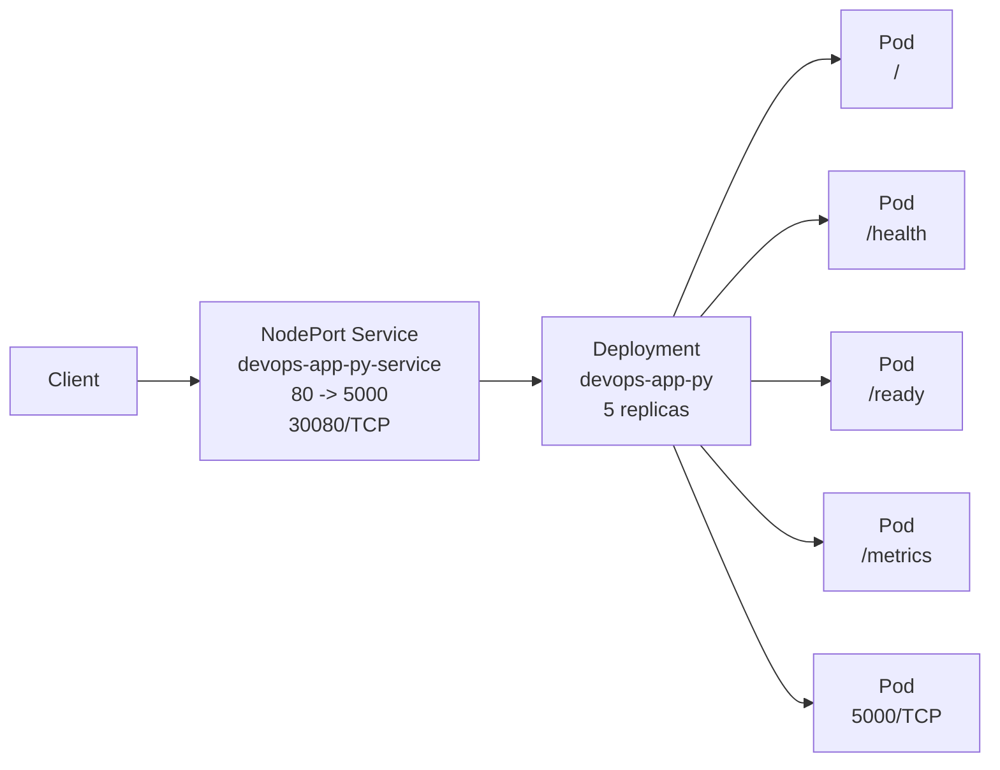

# Kubernetes Lab 9

## Task 1 - Local Kubernetes Setup

I used `minikube` because it was in Arch Linux extra repo (`kind` is only in AUR), integrates cleanly with the Docker driver, and has more features.

<details>
<summary>Cluster setup verification output</summary>

```text
$ minikube status
minikube
type: Control Plane
host: Running
kubelet: Running
apiserver: Running
kubeconfig: Configured


$ kubectl cluster-info
Kubernetes control plane is running at https://192.168.49.2:8443
CoreDNS is running at https://192.168.49.2:8443/api/v1/namespaces/kube-system/services/kube-dns:dns/proxy

To further debug and diagnose cluster problems, use 'kubectl cluster-info dump'.

$ kubectl get nodes -o wide
NAME       STATUS   ROLES           AGE     VERSION   INTERNAL-IP    EXTERNAL-IP   OS-IMAGE                         KERNEL-VERSION      CONTAINER-RUNTIME
minikube   Ready    control-plane   2m45s   v1.35.1   192.168.49.2   <none>        Debian GNU/Linux 12 (bookworm)   6.19.10-1-cachyos   docker://29.2.1

$ kubectl get namespaces
NAME              STATUS   AGE
default           Active   3m9s
kube-node-lease   Active   3m9s
kube-public       Active   3m9s
kube-system       Active   3m9s
```

</details>

## Task 2 - Application Deployment

The initial Task 2 deployment used `localt0aster/devops-app-py:1.9` with 3 replicas, rolling updates, and resource requests and limits. At that stage, the probes were `GET /health` for liveness and `GET /ready` for readiness. Task 4 later scaled the manifest to 5 replicas and tightened the rollout strategy.

<details>
<summary>Deployment rollout verification output</summary>

```text
$ kubectl delete deployment devops-app-py --cascade=foreground --wait=true
deployment.apps "devops-app-py" deleted from default namespace

$ kubectl apply -f k8s/deployment.yml
deployment.apps/devops-app-py created

$ kubectl rollout status deployment/devops-app-py --timeout=180s
Waiting for deployment "devops-app-py" rollout to finish: 0 of 3 updated replicas are available...
Waiting for deployment "devops-app-py" rollout to finish: 1 of 3 updated replicas are available...
Waiting for deployment "devops-app-py" rollout to finish: 2 of 3 updated replicas are available...
deployment "devops-app-py" successfully rolled out

$ kubectl get deployment devops-app-py
NAME            READY   UP-TO-DATE   AVAILABLE   AGE
devops-app-py   3/3     3            3           8s

$ kubectl get pods -l app.kubernetes.io/name=devops-app-py -o wide
NAME                             READY   STATUS    RESTARTS   AGE   IP           NODE       NOMINATED NODE   READINESS GATES
devops-app-py-76fc7985df-jq2tr   1/1     Running   0          8s    10.244.0.14   minikube   <none>           <none>
devops-app-py-76fc7985df-jwpsf   1/1     Running   0          8s    10.244.0.13   minikube   <none>           <none>
devops-app-py-76fc7985df-nwr58   1/1     Running   0          8s    10.244.0.12   minikube   <none>           <none>

$ kubectl describe deployment devops-app-py
Name:                   devops-app-py
Namespace:              default
CreationTimestamp:      Fri, 27 Mar 2026 05:16:21 +0300
Labels:                 app.kubernetes.io/name=devops-app-py
                        app.kubernetes.io/part-of=devops-core-s26
Annotations:            deployment.kubernetes.io/revision: 1
Selector:               app.kubernetes.io/name=devops-app-py
Replicas:               3 desired | 3 updated | 3 total | 3 available | 0 unavailable
StrategyType:           RollingUpdate
MinReadySeconds:        0
RollingUpdateStrategy:  1 max unavailable, 1 max surge
Pod Template:
  Labels:  app.kubernetes.io/name=devops-app-py
           app.kubernetes.io/part-of=devops-core-s26
  Containers:
   devops-app-py:
    Image:      localt0aster/devops-app-py:1.9
    Port:       5000/TCP (http)
    Host Port:  0/TCP (http)
    Limits:
      cpu:     250m
      memory:  256Mi
    Requests:
      cpu:      100m
      memory:   128Mi
    Liveness:   http-get http://:http/health delay=10s timeout=2s period=10s #success=1 #failure=3
    Readiness:  http-get http://:http/ready delay=5s timeout=2s period=5s #success=1 #failure=3
    Environment:
      HOST:        0.0.0.0
      PORT:        5000
    Mounts:        <none>
  Volumes:         <none>
  Node-Selectors:  <none>
  Tolerations:     <none>
Conditions:
  Type           Status  Reason
  ----           ------  ------
  Available      True    MinimumReplicasAvailable
  Progressing    True    NewReplicaSetAvailable
OldReplicaSets:  <none>
NewReplicaSet:   devops-app-py-76fc7985df (3/3 replicas created)
Events:
  Type    Reason             Age   From                   Message
  ----    ------             ----  ----                   -------
  Normal  ScalingReplicaSet  9s    deployment-controller  Scaled up replica set devops-app-py-76fc7985df from 0 to 3
```

</details>

## Task 3 - Service Configuration

The Service uses type `NodePort` and targets the Deployment Pods with the `app.kubernetes.io/name=devops-app-py` label. It exposes service port `80` and forwards traffic to container port `5000` on a fixed NodePort, `30080`.

For connectivity verification, I used `kubectl port-forward service/devops-app-py-service 8080:80`. I tested `minikube service ... --url` first, but in this Docker-driver setup the returned node IP was not directly reachable from the host, so port-forward was the practical local-access path.

<details>
<summary>Service verification output</summary>

```text
$ kubectl apply -f k8s/service.yml
service/devops-app-py-service unchanged

$ kubectl get services
NAME                    TYPE        CLUSTER-IP       EXTERNAL-IP   PORT(S)        AGE
devops-app-py-service   NodePort    10.110.168.128   <none>        80:30080/TCP   32s
kubernetes              ClusterIP   10.96.0.1        <none>        443/TCP        80m

$ kubectl describe service devops-app-py-service
Name:                     devops-app-py-service
Namespace:                default
Labels:                   app.kubernetes.io/name=devops-app-py
                          app.kubernetes.io/part-of=devops-core-s26
Annotations:              <none>
Selector:                 app.kubernetes.io/name=devops-app-py
Type:                     NodePort
IP Family Policy:         SingleStack
IP Families:              IPv4
IP:                       10.110.168.128
IPs:                      10.110.168.128
Port:                     http  80/TCP
TargetPort:               5000/TCP
NodePort:                 http  30080/TCP
Endpoints:                10.244.0.12:5000,10.244.0.13:5000,10.244.0.14:5000
Session Affinity:         None
External Traffic Policy:  Cluster
Internal Traffic Policy:  Cluster
Events:                   <none>

$ kubectl get endpoints devops-app-py-service
Warning: v1 Endpoints is deprecated in v1.33+; use discovery.k8s.io/v1 EndpointSlice
NAME                    ENDPOINTS                                            AGE
devops-app-py-service   10.244.0.12:5000,10.244.0.13:5000,10.244.0.14:5000   32s

$ kubectl port-forward service/devops-app-py-service 8080:80
Forwarding from 127.0.0.1:8080 -> 5000
Forwarding from [::1]:8080 -> 5000
Handling connection for 8080
Handling connection for 8080
Handling connection for 8080
Handling connection for 8080

$ curl -fsSL 127.0.0.1:8080 | jq .service.name
"devops-info-service"

$ curl -fsSL 127.0.0.1:8080/health | jq .status
"healthy"

$ curl -fsSL 127.0.0.1:8080/ready | jq .status
"ready"

$ curl -fsSL 127.0.0.1:8080/metrics | head -n 12
# HELP http_requests_total Total HTTP requests handled by the service.
# TYPE http_requests_total counter
http_requests_total{endpoint="/ready",method="GET",status_code="200"} 180.0
http_requests_total{endpoint="/health",method="GET",status_code="200"} 90.0
http_requests_total{endpoint="/",method="GET",status_code="200"} 2.0
http_requests_total{endpoint="/metrics",method="GET",status_code="200"} 1.0
# HELP http_requests_created Total HTTP requests handled by the service.
# TYPE http_requests_created gauge
http_requests_created{endpoint="/ready",method="GET",status_code="200"} 1.7745777896655755e+09
http_requests_created{endpoint="/health",method="GET",status_code="200"} 1.7745778018120363e+09
http_requests_created{endpoint="/",method="GET",status_code="200"} 1.7745779956714542e+09
http_requests_created{endpoint="/metrics",method="GET",status_code="200"} 1.7745779957933705e+09
```

</details>

## Task 4 - Scaling and Updates

I scaled the Deployment declaratively to 5 replicas and verified that all 5 Pods were running. For the rolling-update portion, I changed the pod template with a temporary `LOG_LEVEL=DEBUG` environment variable. An in-cluster probe exposed a brief failed request with `maxUnavailable: 1`, so I changed the strategy to `maxUnavailable: 0` and reran the rollout. With that stricter strategy, the Service returned `200` for 35 consecutive `/ready` checks during the rollout. I then used `kubectl rollout undo` and returned the live Deployment to the baseline `1.9` pod template while keeping the safer rollout strategy in the manifest.

<details>
<summary>Scaling to 5 replicas</summary>

```text
$ kubectl apply -f k8s/deployment.yml
deployment.apps/devops-app-py configured

$ kubectl rollout status deployment/devops-app-py --timeout=180s
Waiting for deployment "devops-app-py" rollout to finish: 3 of 5 updated replicas are available...
Waiting for deployment "devops-app-py" rollout to finish: 4 of 5 updated replicas are available...
deployment "devops-app-py" successfully rolled out

$ kubectl get deployment devops-app-py -o wide
NAME            READY   UP-TO-DATE   AVAILABLE   AGE   CONTAINERS      IMAGES                               SELECTOR
devops-app-py   5/5     5            5           21m   devops-app-py   localt0aster/devops-app-py:1.9   app.kubernetes.io/name=devops-app-py

$ kubectl get pods -l app.kubernetes.io/name=devops-app-py -o wide
NAME                             READY   STATUS    RESTARTS   AGE   IP            NODE       NOMINATED NODE   READINESS GATES
devops-app-py-76fc7985df-jmnrd   1/1     Running   0          13s   10.244.0.16   minikube   <none>           <none>
devops-app-py-76fc7985df-jq2tr   1/1     Running   0          21m   10.244.0.14   minikube   <none>           <none>
devops-app-py-76fc7985df-jrgms   1/1     Running   0          13s   10.244.0.15   minikube   <none>           <none>
devops-app-py-76fc7985df-jwpsf   1/1     Running   0          21m   10.244.0.13   minikube   <none>           <none>
devops-app-py-76fc7985df-nwr58   1/1     Running   0          21m   10.244.0.12   minikube   <none>           <none>
```

</details>

<details>
<summary>Rolling update with corrected zero-downtime strategy</summary>

```text
$ kubectl apply -f k8s/deployment.yml
deployment.apps/devops-app-py configured

$ kubectl rollout status deployment/devops-app-py --timeout=240s
Waiting for deployment "devops-app-py" rollout to finish: 1 out of 5 new replicas have been updated...
Waiting for deployment "devops-app-py" rollout to finish: 1 out of 5 new replicas have been updated...
Waiting for deployment "devops-app-py" rollout to finish: 1 out of 5 new replicas have been updated...
Waiting for deployment "devops-app-py" rollout to finish: 2 out of 5 new replicas have been updated...
Waiting for deployment "devops-app-py" rollout to finish: 2 out of 5 new replicas have been updated...
Waiting for deployment "devops-app-py" rollout to finish: 2 out of 5 new replicas have been updated...
Waiting for deployment "devops-app-py" rollout to finish: 2 out of 5 new replicas have been updated...
Waiting for deployment "devops-app-py" rollout to finish: 3 out of 5 new replicas have been updated...
Waiting for deployment "devops-app-py" rollout to finish: 3 out of 5 new replicas have been updated...
Waiting for deployment "devops-app-py" rollout to finish: 3 out of 5 new replicas have been updated...
Waiting for deployment "devops-app-py" rollout to finish: 3 out of 5 new replicas have been updated...
Waiting for deployment "devops-app-py" rollout to finish: 4 out of 5 new replicas have been updated...
Waiting for deployment "devops-app-py" rollout to finish: 4 out of 5 new replicas have been updated...
Waiting for deployment "devops-app-py" rollout to finish: 4 out of 5 new replicas have been updated...
Waiting for deployment "devops-app-py" rollout to finish: 4 out of 5 new replicas have been updated...
Waiting for deployment "devops-app-py" rollout to finish: 1 old replicas are pending termination...
Waiting for deployment "devops-app-py" rollout to finish: 1 old replicas are pending termination...
Waiting for deployment "devops-app-py" rollout to finish: 1 old replicas are pending termination...
deployment "devops-app-py" successfully rolled out

$ kubectl get rs -l app.kubernetes.io/name=devops-app-py -o wide
NAME                       DESIRED   CURRENT   READY   AGE     CONTAINERS      IMAGES                               SELECTOR
devops-app-py-65fc658668   5         5         5       6m45s   devops-app-py   localt0aster/devops-app-py:1.9   app.kubernetes.io/name=devops-app-py,pod-template-hash=65fc658668
devops-app-py-76fc7985df   0         0         0       29m     devops-app-py   localt0aster/devops-app-py:1.9   app.kubernetes.io/name=devops-app-py,pod-template-hash=76fc7985df

$ kubectl get deployment devops-app-py -o wide
NAME            READY   UP-TO-DATE   AVAILABLE   AGE   CONTAINERS      IMAGES                               SELECTOR
devops-app-py   5/5     5            5           29m   devops-app-py   localt0aster/devops-app-py:1.9   app.kubernetes.io/name=devops-app-py

$ kubectl rollout history deployment/devops-app-py
deployment.apps/devops-app-py
REVISION  CHANGE-CAUSE
5         <none>
6         <none>
```

</details>

<details>
<summary>In-cluster readiness probe during rollout</summary>

```text
$ kubectl run task4-probe-zdt \
    --image=curlimages/curl --rm -i --command -- \
    sh -c '
      for i in $(seq 1 35); do
        code=$(curl -sS -o /dev/null -w "%{http_code}" http://devops-app-py-service/ready)
        printf "%s %s\n" "$(date +%H:%M:%S)" "$code"
        sleep 1
      done
    '
All commands and output from this session will be recorded in container logs, including credentials and sensitive information passed through the command prompt.
If you don't see a command prompt, try pressing enter.
02:44:47 200
02:44:48 200
02:44:49 200
02:44:50 200
02:44:51 200
02:44:52 200
02:44:53 200
02:44:54 200
02:44:55 200
02:44:56 200
02:44:57 200
02:44:58 200
02:44:59 200
02:45:00 200
02:45:01 200
02:45:02 200
02:45:03 200
02:45:04 200
02:45:05 200
02:45:06 200
02:45:07 200
02:45:08 200
02:45:09 200
02:45:10 200
02:45:11 200
02:45:12 200
02:45:13 200
02:45:14 200
02:45:15 200
02:45:16 200
02:45:17 200
02:45:18 200
02:45:19 200
02:45:20 200
pod "task4-probe-zdt" deleted from default namespace
```

</details>

<details>
<summary>Rollback and rollout history</summary>

```text
$ kubectl rollout undo deployment/devops-app-py
deployment.apps/devops-app-py rolled back

$ kubectl rollout status deployment/devops-app-py --timeout=240s
Waiting for deployment "devops-app-py" rollout to finish: 1 out of 5 new replicas have been updated...
Waiting for deployment "devops-app-py" rollout to finish: 1 out of 5 new replicas have been updated...
Waiting for deployment "devops-app-py" rollout to finish: 1 out of 5 new replicas have been updated...
Waiting for deployment "devops-app-py" rollout to finish: 2 out of 5 new replicas have been updated...
Waiting for deployment "devops-app-py" rollout to finish: 2 out of 5 new replicas have been updated...
Waiting for deployment "devops-app-py" rollout to finish: 2 out of 5 new replicas have been updated...
Waiting for deployment "devops-app-py" rollout to finish: 2 out of 5 new replicas have been updated...
Waiting for deployment "devops-app-py" rollout to finish: 3 out of 5 new replicas have been updated...
Waiting for deployment "devops-app-py" rollout to finish: 3 out of 5 new replicas have been updated...
Waiting for deployment "devops-app-py" rollout to finish: 3 out of 5 new replicas have been updated...
Waiting for deployment "devops-app-py" rollout to finish: 3 out of 5 new replicas have been updated...
Waiting for deployment "devops-app-py" rollout to finish: 4 out of 5 new replicas have been updated...
Waiting for deployment "devops-app-py" rollout to finish: 4 out of 5 new replicas have been updated...
Waiting for deployment "devops-app-py" rollout to finish: 4 out of 5 new replicas have been updated...
Waiting for deployment "devops-app-py" rollout to finish: 4 out of 5 new replicas have been updated...
Waiting for deployment "devops-app-py" rollout to finish: 1 old replicas are pending termination...
Waiting for deployment "devops-app-py" rollout to finish: 1 old replicas are pending termination...
Waiting for deployment "devops-app-py" rollout to finish: 1 old replicas are pending termination...
deployment "devops-app-py" successfully rolled out

$ kubectl get rs -l app.kubernetes.io/name=devops-app-py -o wide
NAME                       DESIRED   CURRENT   READY   AGE     CONTAINERS      IMAGES                               SELECTOR
devops-app-py-65fc658668   0         0         0       7m45s   devops-app-py   localt0aster/devops-app-py:1.9   app.kubernetes.io/name=devops-app-py,pod-template-hash=65fc658668
devops-app-py-76fc7985df   5         5         5       30m     devops-app-py   localt0aster/devops-app-py:1.9   app.kubernetes.io/name=devops-app-py,pod-template-hash=76fc7985df

$ kubectl get deployment devops-app-py -o wide
NAME            READY   UP-TO-DATE   AVAILABLE   AGE   CONTAINERS      IMAGES                               SELECTOR
devops-app-py   5/5     5            5           30m   devops-app-py   localt0aster/devops-app-py:1.9   app.kubernetes.io/name=devops-app-py

$ kubectl rollout history deployment/devops-app-py
deployment.apps/devops-app-py
REVISION  CHANGE-CAUSE
6         <none>
7         <none>
```

</details>

## Task 5 - Documentation

### Architecture Overview

The final Kubernetes layout is one `Deployment` and one `NodePort` `Service` in the default namespace. The Deployment runs 5 Flask Pods from `localt0aster/devops-app-py:1.9`, and the Service load-balances traffic from port `80` to container port `5000`.



The resource strategy is intentionally small and predictable for a local lab cluster: each Pod requests `100m` CPU and `128Mi` memory, with limits of `250m` CPU and `256Mi` memory. For rollouts, the Deployment now uses `maxSurge: 1` and `maxUnavailable: 0` to preserve availability during Pod replacement.

### Manifest Files

- `k8s/deployment.yml`: defines the `Deployment`, `5` replicas, the `1.9` Python image, labels/selectors, container port, `HOST` and `PORT` environment variables, resource requests and limits, and liveness/readiness probes. `maxUnavailable: 0` was chosen after testing showed that `1` could still allow a transient failed request during rollout.
- `k8s/service.yml`: defines the `NodePort` `Service`, maps service port `80` to target port `5000`, uses node port `30080`, and selects Pods by `app.kubernetes.io/name=devops-app-py`.

### Deployment Evidence

<details>
<summary>Final cluster evidence</summary>

```text
$ kubectl apply -f k8s/deployment.yml
deployment.apps/devops-app-py configured

$ kubectl get all
NAME                                 READY   STATUS    RESTARTS   AGE
pod/devops-app-py-76fc7985df-6hmn5   1/1     Running   0          52s
pod/devops-app-py-76fc7985df-6rk64   1/1     Running   0          69s
pod/devops-app-py-76fc7985df-hr29v   1/1     Running   0          61s
pod/devops-app-py-76fc7985df-ptjkm   1/1     Running   0          78s
pod/devops-app-py-76fc7985df-t6d7b   1/1     Running   0          44s

NAME                            TYPE        CLUSTER-IP       EXTERNAL-IP   PORT(S)        AGE
service/devops-app-py-service   NodePort    10.110.168.128   <none>        80:30080/TCP   27m
service/kubernetes              ClusterIP   10.96.0.1        <none>        443/TCP        107m

NAME                            READY   UP-TO-DATE   AVAILABLE   AGE
deployment.apps/devops-app-py   5/5     5            5           30m

NAME                                       DESIRED   CURRENT   READY   AGE
replicaset.apps/devops-app-py-65fc658668   0         0         0       8m20s
replicaset.apps/devops-app-py-76fc7985df   5         5         5       30m

$ kubectl get pods,svc -o wide
NAME                                 READY   STATUS    RESTARTS   AGE   IP            NODE       NOMINATED NODE   READINESS GATES
pod/devops-app-py-76fc7985df-6hmn5   1/1     Running   0          52s   10.244.0.47   minikube   <none>           <none>
pod/devops-app-py-76fc7985df-6rk64   1/1     Running   0          69s   10.244.0.45   minikube   <none>           <none>
pod/devops-app-py-76fc7985df-hr29v   1/1     Running   0          61s   10.244.0.46   minikube   <none>           <none>
pod/devops-app-py-76fc7985df-ptjkm   1/1     Running   0          78s   10.244.0.44   minikube   <none>           <none>
pod/devops-app-py-76fc7985df-t6d7b   1/1     Running   0          44s   10.244.0.48   minikube   <none>           <none>

NAME                            TYPE        CLUSTER-IP       EXTERNAL-IP   PORT(S)        AGE    SELECTOR
service/devops-app-py-service   NodePort    10.110.168.128   <none>        80:30080/TCP   27m    app.kubernetes.io/name=devops-app-py
service/kubernetes              ClusterIP   10.96.0.1        <none>        443/TCP        107m   <none>

$ kubectl describe deployment devops-app-py
Name:                   devops-app-py
Namespace:              default
CreationTimestamp:      Fri, 27 Mar 2026 05:16:21 +0300
Labels:                 app.kubernetes.io/name=devops-app-py
                        app.kubernetes.io/part-of=devops-core-s26
Annotations:            deployment.kubernetes.io/revision: 7
Selector:               app.kubernetes.io/name=devops-app-py
Replicas:               5 desired | 5 updated | 5 total | 5 available | 0 unavailable
StrategyType:           RollingUpdate
MinReadySeconds:        0
RollingUpdateStrategy:  0 max unavailable, 1 max surge
Pod Template:
  Labels:  app.kubernetes.io/name=devops-app-py
           app.kubernetes.io/part-of=devops-core-s26
  Containers:
   devops-app-py:
    Image:      localt0aster/devops-app-py:1.9
    Port:       5000/TCP (http)
    Host Port:  0/TCP (http)
    Limits:
      cpu:     250m
      memory:  256Mi
    Requests:
      cpu:      100m
      memory:   128Mi
    Liveness:   http-get http://:http/health delay=10s timeout=2s period=10s #success=1 #failure=3
    Readiness:  http-get http://:http/ready delay=5s timeout=2s period=5s #success=1 #failure=3
    Environment:
      HOST:        0.0.0.0
      PORT:        5000
    Mounts:        <none>
  Volumes:         <none>
  Node-Selectors:  <none>
  Tolerations:     <none>
Conditions:
  Type           Status  Reason
  ----           ------  ------
  Available      True    MinimumReplicasAvailable
  Progressing    True    NewReplicaSetAvailable
OldReplicaSets:  devops-app-py-65fc658668 (0/0 replicas created)
NewReplicaSet:   devops-app-py-76fc7985df (5/5 replicas created)
Events:
  Type    Reason             Age                    From                   Message
  ----    ------             ----                   ----                   -------
  Normal  ScalingReplicaSet  30m                    deployment-controller  Scaled up replica set devops-app-py-76fc7985df from 0 to 3
  Normal  ScalingReplicaSet  9m21s                  deployment-controller  Scaled up replica set devops-app-py-76fc7985df from 3 to 5
  Normal  ScalingReplicaSet  8m20s                  deployment-controller  Scaled up replica set devops-app-py-65fc658668 from 0 to 1
  Normal  ScalingReplicaSet  8m20s                  deployment-controller  Scaled up replica set devops-app-py-65fc658668 from 1 to 2
  Normal  ScalingReplicaSet  8m12s                  deployment-controller  Scaled down replica set devops-app-py-76fc7985df from 4 to 3
  Normal  ScalingReplicaSet  8m12s                  deployment-controller  Scaled up replica set devops-app-py-65fc658668 from 2 to 3
  Normal  ScalingReplicaSet  8m12s                  deployment-controller  Scaled down replica set devops-app-py-76fc7985df from 3 to 2
  Normal  ScalingReplicaSet  8m12s                  deployment-controller  Scaled up replica set devops-app-py-65fc658668 from 3 to 4
  Normal  ScalingReplicaSet  8m3s                   deployment-controller  Scaled down replica set devops-app-py-76fc7985df from 2 to 1
  Normal  ScalingReplicaSet  4m58s (x2 over 8m20s)  deployment-controller  Scaled down replica set devops-app-py-76fc7985df from 5 to 4
  Normal  ScalingReplicaSet  3m39s (x22 over 8m3s)  deployment-controller  (combined from similar events): Scaled up replica set devops-app-py-76fc7985df from 0 to 1

$ kubectl run task5-curl \
    --image=curlimages/curl \
    \
    --rm -i \
    --command -- \
    sh -c '
      curl -fsS http://devops-app-py-service
      printf "\n\n"
      curl -fsS http://devops-app-py-service/health
      printf "\n\n"
      curl -fsS http://devops-app-py-service/ready
      printf "\n\n"
      curl -fsS http://devops-app-py-service/metrics | head -n 12
    '
{
  "endpoints": [
    {
      "description": "Service information.",
      "method": "GET",
      "path": "/"
    },
    {
      "description": "Health check.",
      "method": "GET",
      "path": "/health"
    },
    {
      "description": "Prometheus metrics.",
      "method": "GET",
      "path": "/metrics"
    },
    {
      "description": "Readiness check.",
      "method": "GET",
      "path": "/ready"
    }
  ],
  "request": {
    "client_ip": "10.244.0.49",
    "method": "GET",
    "path": "/",
    "user_agent": "curl/8.12.1"
  },
  "runtime": {
    "human": "0 hours, 1 minutes",
    "seconds": 61
  },
  "service": {
    "description": "DevOps course info service",
    "framework": "Flask",
    "name": "devops-info-service",
    "version": "1.8.0"
  },
  "system": {
    "architecture": "x86_64",
    "cpu_count": 8,
    "hostname": "devops-app-py-76fc7985df-6rk64",
    "platform": "Linux",
    "platform_version": "Alpine Linux v3.23",
    "python_version": "3.14.3"
  }
}


{
  "status": "healthy",
  "timestamp": "2026-03-27T02:47:15.357513+00:00",
  "uptime_seconds": 70
}


{
  "status": "ready",
  "timestamp": "2026-03-27T02:47:15.363373+00:00",
  "uptime_seconds": 53
}


# HELP http_requests_total Total HTTP requests handled by the service.
# TYPE http_requests_total counter
http_requests_total{endpoint="/ready",method="GET",status_code="200"} 13.0
http_requests_total{endpoint="/health",method="GET",status_code="200"} 5.0
http_requests_total{endpoint="/",method="GET",status_code="200"} 1.0
# HELP http_requests_created Total HTTP requests handled by the service.
# TYPE http_requests_created gauge
http_requests_created{endpoint="/ready",method="GET",status_code="200"} 1.7745795737986815e+09
http_requests_created{endpoint="/health",method="GET",status_code="200"} 1.7745795857890186e+09
http_requests_created{endpoint="/",method="GET",status_code="200"} 1.774579635349531e+09
# HELP http_request_duration_seconds HTTP request duration in seconds.
# TYPE http_request_duration_seconds histogram
pod "task5-curl" deleted from default namespace
```

</details>

### Operations Performed

1. Deployment and verification:

   ```bash
   kubectl apply -f k8s/deployment.yml
   kubectl rollout status deployment/devops-app-py
   kubectl get deployment devops-app-py -o wide
   kubectl get pods -l app.kubernetes.io/name=devops-app-py -o wide
   kubectl describe deployment devops-app-py
   ```

2. Service setup and access checks:

   ```bash
   kubectl apply -f k8s/service.yml
   kubectl describe service devops-app-py-service
   kubectl port-forward service/devops-app-py-service 8080:80
   kubectl run task5-curl --image=curlimages/curl --rm -i --command -- sh
   ```

3. Scaling to 5 replicas:

   ```bash
   kubectl apply -f k8s/deployment.yml
   kubectl rollout status deployment/devops-app-py --timeout=180s
   kubectl get pods -l app.kubernetes.io/name=devops-app-py -o wide
   ```

4. Rolling updates and rollback:

   ```bash
   kubectl apply -f k8s/deployment.yml
   kubectl rollout status deployment/devops-app-py --timeout=240s
   kubectl rollout history deployment/devops-app-py
   kubectl rollout undo deployment/devops-app-py
   ```

### Production Considerations

- Health checks: `/health` is used for liveness and `/ready` is used for readiness so Kubernetes only sends traffic to Pods that are actually prepared to serve requests.
- Rollout safety: `maxUnavailable: 0` and `maxSurge: 1` were chosen to keep capacity available during updates. This was not just theoretical; the strategy was tightened after observing a transient failed request with `maxUnavailable: 1`.
- Resource limits: `100m/128Mi` requests and `250m/256Mi` limits are reasonable for a lab environment and protect the single-node cluster from noisy-neighbor behavior.
- Observability: the app exposes `/metrics`, which is ready for Prometheus scraping. `kubectl describe`, rollout history, and event inspection were enough for this lab, but production should add centralized logs and dashboards.
- Further improvements: use image digests instead of mutable tags, add a `PodDisruptionBudget`, enable `HorizontalPodAutoscaler`, isolate workloads in a dedicated namespace, and place an Ingress with TLS in front of the NodePort service.

### Challenges & Solutions

- `minikube service devops-app-py-service --url` returned a valid NodePort URL, but with the Docker driver that node IP was not directly reachable from the host. I used `kubectl port-forward` for local testing and an in-cluster curl Pod for authoritative service verification.
- The first zero-downtime test with `maxUnavailable: 1` produced a brief failed request during rollout. Instead of papering over it, I changed the Deployment strategy to `maxUnavailable: 0` and reran the test until the probe showed a clean `200` sequence.
- Host-side port-forward tests can introduce their own connection artifacts during fast backend replacement. The more reliable method here was probing the Kubernetes Service from inside the cluster.

