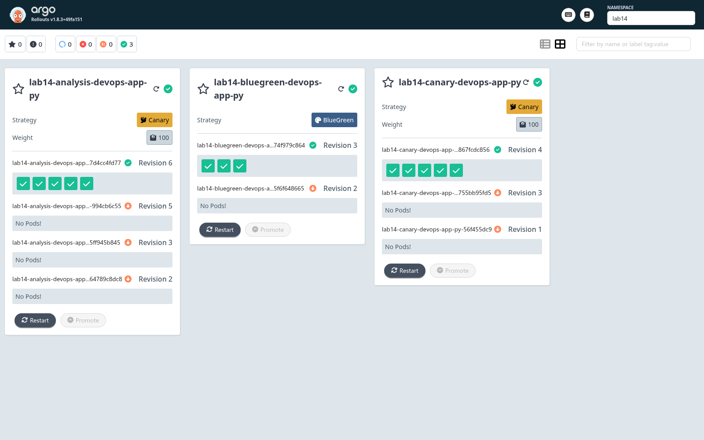
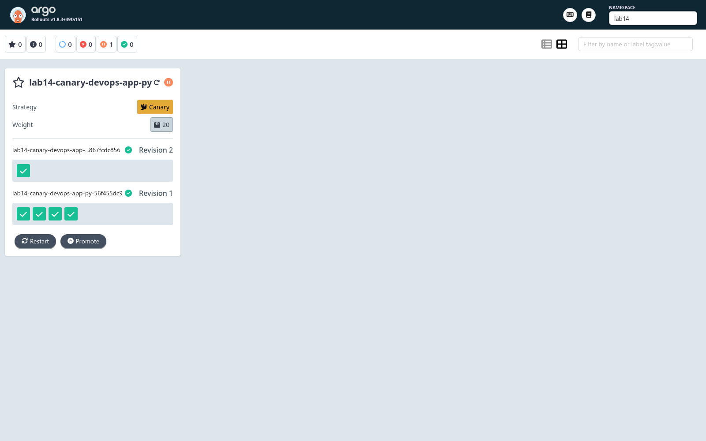
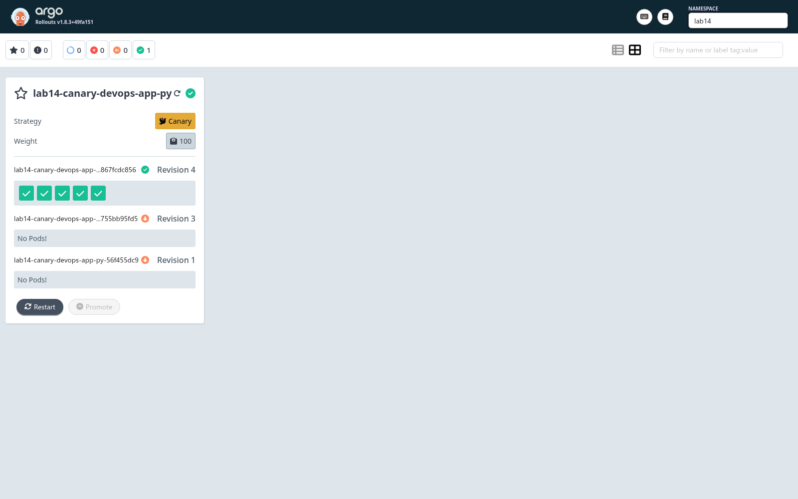
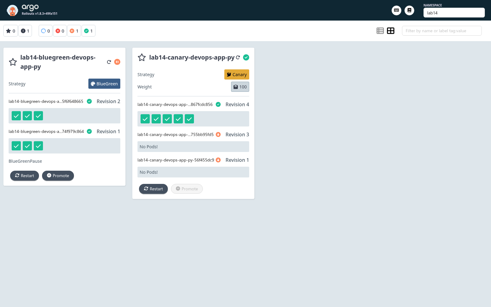
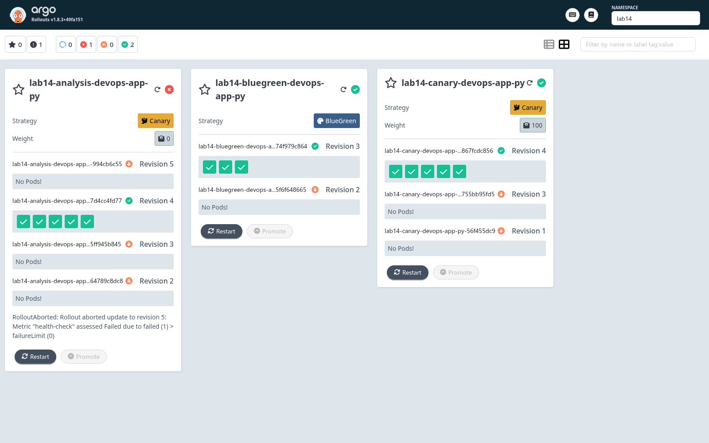

# Kubernetes Lab 14 - Progressive Delivery with Argo Rollouts

Lab 14 adds progressive delivery to the existing Helm chart without changing the Lab 13 ArgoCD applications. I kept the GitOps `dev` and `prod` applications on normal Kubernetes `Deployment` resources and added an opt-in Rollout mode to the chart. The lab demos use direct Helm releases in a separate `lab14` namespace so manual canary pauses, aborts, blue-green promotions, and failed analysis runs do not fight ArgoCD reconciliation.

The chart now supports three workload modes:

- Default mode: renders the original `apps/v1 Deployment` when `rollout.enabled=false`.
- Canary mode: renders an Argo `Rollout` with weighted steps and pauses.
- Blue-green mode: renders an Argo `Rollout` plus a preview `Service`.
- Bonus analysis mode: renders an `AnalysisTemplate` and attaches it to the canary strategy.

The Rollouts controller and dashboard manifests are pinned to `v1.8.3`. I deliberately did not use `latest` URLs or release candidates because this lab should be reproducible. On this machine, Helm is `v4.1.4`; after Argo Rollouts or the Rollouts plugin mutates controller-owned fields, follow-up Helm upgrades use `--server-side=false` to avoid server-side-apply ownership conflicts.

The local Rollouts CLI is installed from Nix instead of a manually downloaded `/tmp/lab14/bin` binary. On current nixpkgs, direct `nix run nixpkgs#argo-rollouts` is not usable because the package exposes `kubectl-argo-rollouts` and `rollouts-controller`, while `nix run` looks for `bin/argo-rollouts`.

## Chart Changes

The Helm chart was bumped to `0.6.0` and remains backward compatible with Labs 10-13. The pod template is now shared by Deployment and Rollout resources through the `devops-app-py.podTemplate` helper, which keeps probes, environment variables, Vault annotations, config checksum annotations, PVC mounts, and resource limits consistent.

New chart files:

- `templates/rollout.yaml`: renders the Argo Rollouts `Rollout` resource when `rollout.enabled=true`.
- `templates/analysis-template.yaml`: renders a web-provider `AnalysisTemplate` when automated analysis is enabled.
- `templates/service-preview.yaml`: renders the blue-green preview service.
- `values-rollout-canary.yaml`: reproducible canary demo values.
- `values-rollout-bluegreen.yaml`: reproducible blue-green demo values.
- `values-rollout-analysis.yaml`: reproducible bonus analysis demo values.

The default `values.yaml` keeps `rollout.enabled: false`, so existing ArgoCD applications still render a `Deployment`.

## Setup

The intended install path is:

```bash
kubectl create namespace argo-rollouts --dry-run=client -o yaml | kubectl apply -f -
kubectl apply -n argo-rollouts -f https://github.com/argoproj/argo-rollouts/releases/download/v1.8.3/install.yaml
kubectl apply -n argo-rollouts -f https://github.com/argoproj/argo-rollouts/releases/download/v1.8.3/dashboard-install.yaml

nix profile install --impure nixpkgs#argo-rollouts

kubectl argo rollouts version
kubectl get pods -n argo-rollouts
kubectl port-forward svc/argo-rollouts-dashboard -n argo-rollouts 3100:3100
```

The dashboard is then available at `127.0.0.1:3100`.

On April 29, 2026 the saved Docker-backed `minikube` profile was not recoverable by restart: Docker no longer had the `minikube` container, and two `minikube start -p minikube --driver=docker` attempts failed with `K8S_APISERVER_MISSING`. I deleted and recreated that broken profile only after those repair attempts failed. The repository Lab 13 ArgoCD files were left untouched, but the previous live in-cluster Lab 13 state did not survive the local profile recreation.

The recreated cluster and Rollouts install were healthy:

```text
$ minikube status -p minikube
minikube
type: Control Plane
host: Running
kubelet: Running
apiserver: Running
kubeconfig: Configured

$ kubectl get pods -n argo-rollouts
NAME                                       READY   STATUS    RESTARTS
argo-rollouts-7858b65d86-xrddz             1/1     Running   0
argo-rollouts-dashboard-7d89499989-t7sx6   1/1     Running   0

$ command -v kubectl-argo-rollouts
/home/t0ast/.nix-profile/bin/kubectl-argo-rollouts

$ kubectl argo rollouts version
kubectl-argo-rollouts: v99.99.99+unknown
  BuildDate: 1970-01-01T00:00:00Z
  GitCommit:
  GitTreeState:
  GoVersion: go1.26.2
  Compiler: gc
  Platform: linux/amd64
```

## Rollout vs Deployment

A Rollout keeps the familiar Deployment shape: `replicas`, `selector`, and `template` still describe the desired pods. The meaningful difference is the strategy controller. A Deployment only supports Kubernetes rolling update or recreate behavior. A Rollout adds canary and blue-green strategies, manual gates, abort/retry/undo commands, service selector management, optional traffic routing integrations, and analysis-driven promotion or rollback.

I used Rollouts only where the lab needs those progressive delivery controls. The normal chart path still uses Deployment because simple environments do not need the extra controller dependency.

## Canary Deployment

The canary release uses five replicas so the no-service-mesh weights map cleanly to pods:

```yaml
rollout:
  enabled: true
  strategy: canary
  canary:
    steps:
      - setWeight: 20
      - pause: {}
      - setWeight: 40
      - pause:
          duration: 30s
      - setWeight: 60
      - pause:
          duration: 30s
      - setWeight: 80
      - pause:
          duration: 30s
      - setWeight: 100
```

Without Istio, NGINX, ALB, or another traffic router, `setWeight` does not produce exact L7 traffic splitting. Argo Rollouts approximates the requested weight by scaling the stable and canary ReplicaSets behind the same Kubernetes Service. With `replicaCount: 5`, the lab's `20/40/60/80` steps map to `1/2/3/4` canary pods, which makes the behavior easy to inspect in the dashboard.

Canary install and manual gate:

```bash
kubectl create namespace lab14 --dry-run=client -o yaml | kubectl apply -f -
helm upgrade --install lab14-canary k8s/devops-app-py \
  -n lab14 \
  -f k8s/devops-app-py/values-rollout-canary.yaml

cat >/tmp/lab14/canary-v2.values.yaml <<'YAML'
podAnnotations:
  lab14-version: canary-v2
YAML

helm upgrade lab14-canary k8s/devops-app-py \
  -n lab14 \
  -f k8s/devops-app-py/values-rollout-canary.yaml \
  -f /tmp/lab14/canary-v2.values.yaml

kubectl argo rollouts get rollout lab14-canary-devops-app-py -n lab14
kubectl argo rollouts promote lab14-canary-devops-app-py -n lab14
```

Abort and rollback demonstration:

```bash
cat >/tmp/lab14/canary-v3.values.yaml <<'YAML'
podAnnotations:
  lab14-version: canary-v3
YAML

helm upgrade lab14-canary k8s/devops-app-py \
  -n lab14 \
  -f k8s/devops-app-py/values-rollout-canary.yaml \
  -f /tmp/lab14/canary-v3.values.yaml

kubectl argo rollouts abort lab14-canary-devops-app-py -n lab14
kubectl argo rollouts undo lab14-canary-devops-app-py -n lab14
kubectl argo rollouts status lab14-canary-devops-app-py -n lab14
```

## Blue-Green Deployment

The blue-green release uses the existing chart service as the active service and adds a preview service:

```yaml
rollout:
  enabled: true
  strategy: blueGreen
  blueGreen:
    activeService: ""
    previewService:
      enabled: true
      name: ""
    autoPromotionEnabled: false
    scaleDownDelaySeconds: 30
```

An empty `activeService` resolves to the chart's normal service name, for example `lab14-bluegreen-devops-app-py-service`. The preview service resolves to `lab14-bluegreen-devops-app-py-service-preview`. Argo Rollouts mutates the active and preview service selectors so the active service points at the stable ReplicaSet while the preview service points at the new ReplicaSet.

Blue-green test flow:

```bash
helm upgrade --install lab14-bluegreen k8s/devops-app-py \
  -n lab14 \
  -f k8s/devops-app-py/values-rollout-bluegreen.yaml

cat >/tmp/lab14/green-v2.values.yaml <<'YAML'
podAnnotations:
  lab14-version: green-v2
YAML

helm upgrade lab14-bluegreen k8s/devops-app-py \
  -n lab14 \
  -f k8s/devops-app-py/values-rollout-bluegreen.yaml \
  -f /tmp/lab14/green-v2.values.yaml \
  --server-side=false

kubectl port-forward svc/lab14-bluegreen-devops-app-py-service -n lab14 18080:80
kubectl port-forward svc/lab14-bluegreen-devops-app-py-service-preview -n lab14 18081:80
curl -fsSL http://127.0.0.1:18080/health
curl -fsSL http://127.0.0.1:18081/health

kubectl argo rollouts promote lab14-bluegreen-devops-app-py -n lab14
kubectl argo rollouts undo lab14-bluegreen-devops-app-py -n lab14
```

The blue-green rollback is faster than canary rollback because it is mostly a service selector switch. The tradeoff is resource usage: during a preview, blue-green needs the stable ReplicaSet and the preview ReplicaSet at the same time.

The active and preview services pointed at different ReplicaSets before promotion:

```text
$ kubectl get svc -n lab14 -l app.kubernetes.io/instance=lab14-bluegreen -o wide
NAME                                            TYPE        CLUSTER-IP       PORT(S)   SELECTOR
lab14-bluegreen-devops-app-py-service           ClusterIP   10.110.96.230    80/TCP    app.kubernetes.io/instance=lab14-bluegreen,app.kubernetes.io/name=devops-app-py,rollouts-pod-template-hash=74f979c864
lab14-bluegreen-devops-app-py-service-preview   ClusterIP   10.103.107.142   80/TCP    app.kubernetes.io/instance=lab14-bluegreen,app.kubernetes.io/name=devops-app-py,rollouts-pod-template-hash=5f6f648665
```

Both services returned healthy responses through separate port-forwards.

## Automated Analysis

The bonus uses the Argo Rollouts web analysis provider instead of Prometheus so it stays self-contained. The chart renders this template:

```yaml
apiVersion: argoproj.io/v1alpha1
kind: AnalysisTemplate
spec:
  metrics:
    - name: health-check
      interval: "5s"
      count: 1
      failureLimit: 0
      successCondition: 'result == "healthy"'
      provider:
        web:
          url: "http://lab14-analysis-devops-app-py-service.lab14.svc:80/health"
          timeoutSeconds: 5
          jsonPath: "{$.status}"
```

The namespaced service DNS name is important because the Rollouts controller evaluates the web metric from the `argo-rollouts` namespace. The Flask app returns `{"status":"healthy"}` from `/health`, so the normal analysis run succeeds. For the intentional failure, I override the expected status to an impossible value:

```bash
helm upgrade --install lab14-analysis k8s/devops-app-py \
  -n lab14 \
  -f k8s/devops-app-py/values-rollout-analysis.yaml

cat >/tmp/lab14/analysis-fail.values.yaml <<'YAML'
podAnnotations:
  lab14-version: analysis-fail-v2
rollout:
  analysis:
    expectedStatus: impossible
YAML

helm upgrade lab14-analysis k8s/devops-app-py \
  -n lab14 \
  -f k8s/devops-app-py/values-rollout-analysis.yaml \
  -f /tmp/lab14/analysis-fail.values.yaml \
  --server-side=false

kubectl get analysisrun -n lab14
kubectl argo rollouts get rollout lab14-analysis-devops-app-py -n lab14
```

With `failureLimit: 0`, one failed measurement marks the AnalysisRun failed and aborts the rollout automatically.

The final evidence included one successful AnalysisRun and one intentional failed AnalysisRun:

```text
$ kubectl get analysisrun -n lab14
NAME                                        STATUS       AGE
lab14-analysis-devops-app-py-7d4cc4fd77-4   Successful   3m11s
lab14-analysis-devops-app-py-994cb6c55-5    Failed       70s
```

## Strategy Comparison

| Strategy                  | Best use                                                        | Strengths                                                                    | Tradeoffs                                                                           |
| ------------------------- | --------------------------------------------------------------- | ---------------------------------------------------------------------------- | ----------------------------------------------------------------------------------- |
| Canary                    | Risky changes where gradual exposure matters                    | Small blast radius, manual gates, automated analysis, progressive confidence | Slower, mixed versions run at once, exact traffic percentages need a traffic router |
| Blue-green                | Releases that need pre-production validation and instant switch | Preview environment, fast promotion, fast rollback                           | Needs duplicate capacity during preview, switch is all-or-nothing                   |
| Deployment rolling update | Routine low-risk changes                                        | Simple, native Kubernetes, no extra controller                               | No dashboard gates, no analysis, weak rollback workflow compared with Rollouts      |

My practical recommendation is to use canary for user-facing changes where regressions may be subtle, blue-green for changes that need manual preview or a fast service-selector rollback, and plain Deployments for internal or low-risk services where progressive delivery would add operational weight without much benefit.

## Screenshots

The dashboard screenshots are stored under `k8s/docs/img/`:











## Command Reference

```bash
helm lint k8s/devops-app-py
helm template lab14-default k8s/devops-app-py --namespace lab14
helm template lab14-canary k8s/devops-app-py --namespace lab14 -f k8s/devops-app-py/values-rollout-canary.yaml
helm template lab14-bluegreen k8s/devops-app-py --namespace lab14 -f k8s/devops-app-py/values-rollout-bluegreen.yaml
helm template lab14-analysis k8s/devops-app-py --namespace lab14 -f k8s/devops-app-py/values-rollout-analysis.yaml

kubectl argo rollouts get rollout lab14-canary-devops-app-py -n lab14
kubectl argo rollouts promote lab14-canary-devops-app-py -n lab14
kubectl argo rollouts abort lab14-canary-devops-app-py -n lab14
kubectl argo rollouts undo lab14-canary-devops-app-py -n lab14
kubectl argo rollouts retry rollout lab14-canary-devops-app-py -n lab14

kubectl argo rollouts get rollout lab14-bluegreen-devops-app-py -n lab14
kubectl argo rollouts promote lab14-bluegreen-devops-app-py -n lab14
kubectl argo rollouts undo lab14-bluegreen-devops-app-py -n lab14

kubectl get analysisrun -n lab14
kubectl describe analysisrun -n lab14
```

## Verification

Static verification completed successfully:

```text
$ helm lint k8s/devops-app-py
==> Linting k8s/devops-app-py
[INFO] Chart.yaml: icon is recommended

1 chart(s) linted, 0 chart(s) failed
```

I also rendered all four chart modes successfully:

```text
$ rg -n "kind: (Deployment|Rollout|AnalysisTemplate|Service)$" /tmp/lab14/render-*.yaml
/tmp/lab14/render-analysis.yaml:104:kind: Service
/tmp/lab14/render-analysis.yaml:127:kind: AnalysisTemplate
/tmp/lab14/render-analysis.yaml:152:kind: Rollout
/tmp/lab14/render-bluegreen.yaml:104:kind: Service
/tmp/lab14/render-bluegreen.yaml:128:kind: Service
/tmp/lab14/render-bluegreen.yaml:151:kind: Rollout
/tmp/lab14/render-canary.yaml:104:kind: Service
/tmp/lab14/render-canary.yaml:127:kind: Rollout
/tmp/lab14/render-default.yaml:104:kind: Service
/tmp/lab14/render-default.yaml:127:kind: Deployment
```

Final cluster verification:

```text
$ kubectl argo rollouts get rollout lab14-canary-devops-app-py -n lab14
Status:          Healthy
Replicas:        Desired 5, Ready 5, Available 5

$ kubectl argo rollouts get rollout lab14-bluegreen-devops-app-py -n lab14
Status:          Healthy
Replicas:        Desired 3, Ready 3, Available 3

$ kubectl argo rollouts get rollout lab14-analysis-devops-app-py -n lab14
Status:          Healthy
Replicas:        Desired 5, Ready 5, Available 5
```

## Final State

The repository-side implementation is complete and keeps existing Lab 13 application manifests compatible. The final cluster state after evidence capture is:

- `argo-rollouts` namespace with the controller and dashboard running.
- `lab14` namespace with healthy canary, blue-green, and analysis Rollouts.
- One successful AnalysisRun and one intentionally failed AnalysisRun retained for bonus evidence.
- Lab 13 `dev` and `prod` ArgoCD application files left untouched in the repository.
