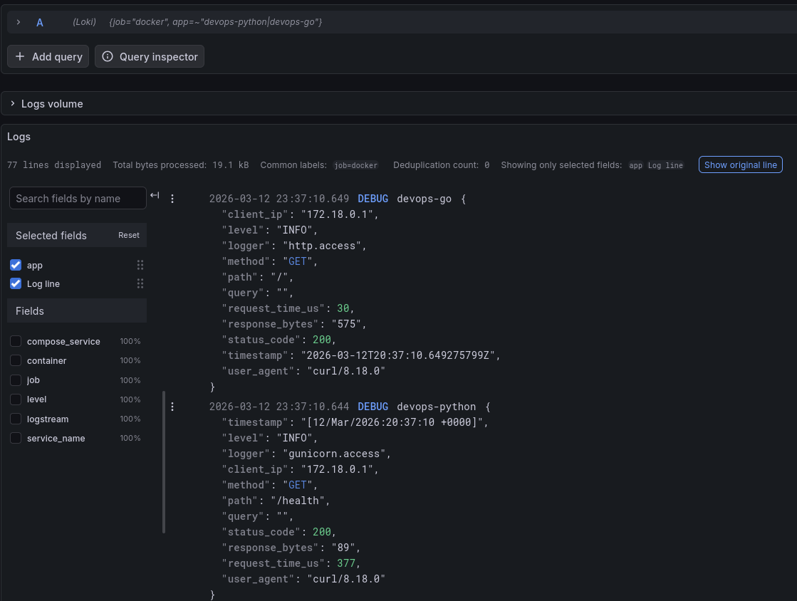
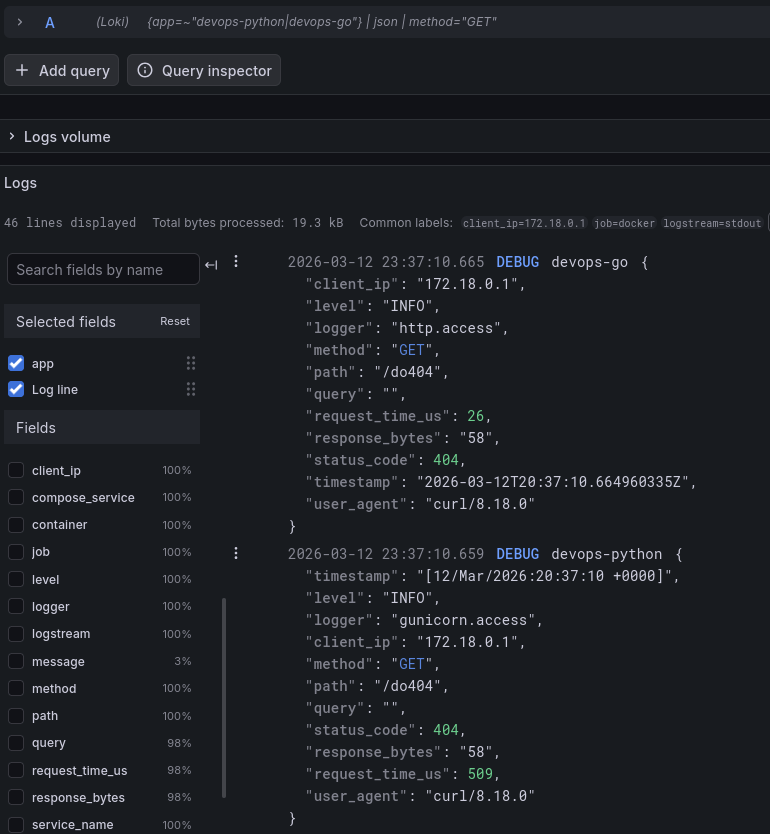
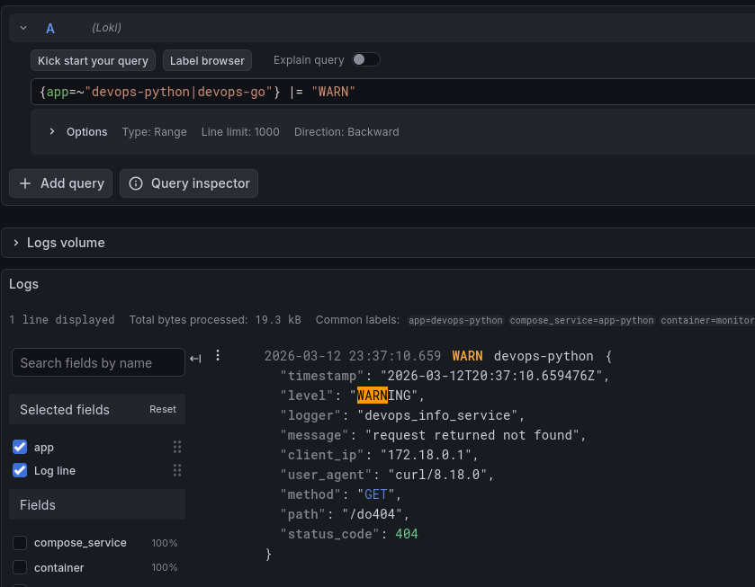
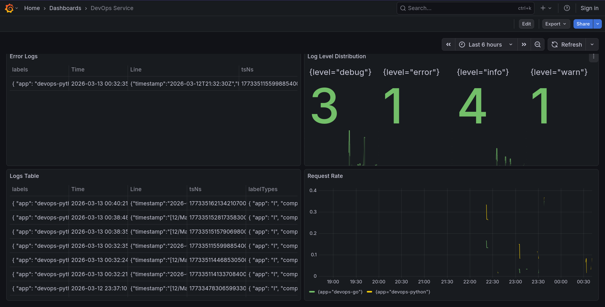
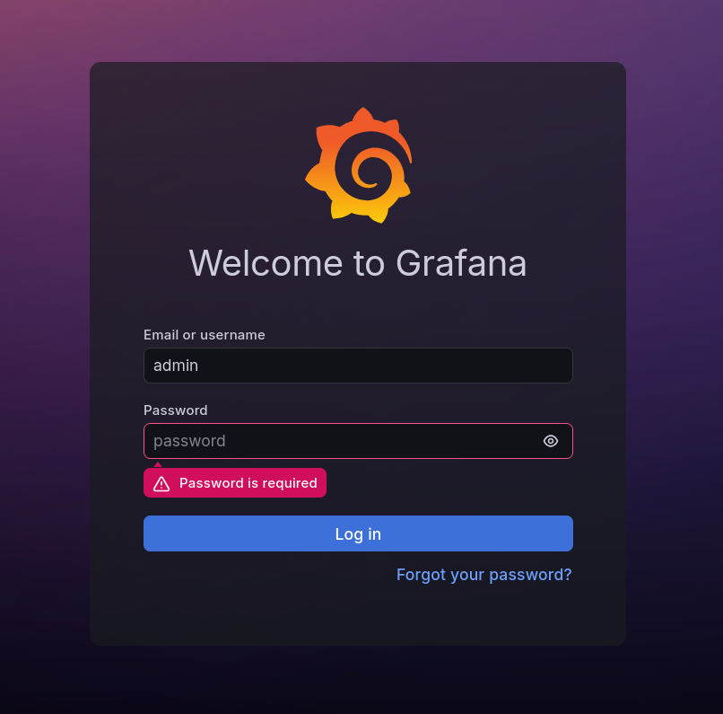

# LAB07 - Observability & Logging with Loki Stack

## 1. Architecture

This lab uses a single Docker Compose stack for log collection, storage, querying, and visualization.

- `loki` stores logs on local disk with TSDB and schema `v13`.
- `promtail` discovers Docker containers through the Docker socket and ships selected logs to Loki.
- `grafana` uses Loki as the default data source and provides Explore plus a custom dashboard.
- `app-python` and `app-go` write structured JSON logs to container stdout.
- Only containers labeled `logging=promtail` are scraped.

Current image tags in Compose are branch-style image tags:

- `localt0aster/devops-app-py:1.7.9a42ee5`
- `localt0aster/devops-app-go:1.7.9a42ee5`

The application payloads themselves report service version `1.7.0`.

```text
curl / browser
    |
    v
+-----------------------------+
| app-python   app-go        |
| JSON logs to stdout        |
+-----------------------------+
    |
    v
+-----------------------------+
| promtail                   |
| docker_sd + relabeling     |
+-----------------------------+
    |
    v
+-----------------------------+
| loki                       |
| TSDB + filesystem storage  |
+-----------------------------+
    |
    v
+-----------------------------+
| grafana                    |
| Explore + dashboard        |
+-----------------------------+
```

## 2. Setup Guide

The project structure for the monitoring stack is:

```text
monitoring/
├── docker-compose.yml
├── loki/config.yml
├── promtail/config.yml
├── grafana/provisioning/datasources/loki.yml
└── docs/LAB07.md
```

Bring the stack up from the repository root:

```bash
cd monitoring
docker compose up -d
docker compose ps
```

Useful local endpoints:

- Grafana: `http://localhost:3000`
- Loki: `http://localhost:3100`
- Promtail: `http://localhost:9080`
- Python app: `http://localhost:8000`
- Go app: `http://localhost:8001`

Basic verification commands:

```bash
curl -fSsL localhost:3100/ready
curl -fSsL localhost:9080/targets
curl -fSsL localhost:3000/api/health
curl -fSsL localhost:8000/health
curl -fSsL localhost:8001/health
```

Grafana is configured to provision Loki automatically, so the data source is available immediately after startup.

## 3. Configuration

### Docker Compose

The stack keeps all services on one shared `monitoring` network and persists Loki, Promtail positions, and Grafana state in named volumes.

Compose excerpt:

```yaml
services:
  loki:
    image: grafana/loki:3.0.0
  promtail:
    image: grafana/promtail:3.0.0
  grafana:
    image: grafana/grafana:12.3.1
  app-python:
    image: localt0aster/devops-app-py:1.7.9a42ee5
    labels:
      logging: "promtail"
      app: "devops-python"
  app-go:
    image: localt0aster/devops-app-go:1.7.9a42ee5
    labels:
      logging: "promtail"
      app: "devops-go"
```

Two practical decisions matter here:

- published images are used for the apps instead of local builds;
- the earlier `build.network: host` workaround is preserved as commented YAML for the tun/VPN case, but it is not active in the final stack.

### Loki

Loki is configured as a single-node instance with filesystem storage, TSDB, schema `v13`, and 7-day retention.

Snippet:

```yaml
common:
  path_prefix: /loki
  replication_factor: 1
  storage:
    filesystem:
      chunks_directory: /loki/chunks

schema_config:
  configs:
    - from: 2024-01-01
      store: tsdb
      object_store: filesystem
      schema: v13

limits_config:
  retention_period: 168h

compactor:
  retention_enabled: true
```

Why this setup:

- TSDB is the current Loki 3.x recommendation.
- Filesystem storage is enough for a single-node lab environment.
- 7-day retention keeps local disk usage bounded.

### Promtail

Promtail uses Docker service discovery and only scrapes labeled containers.

Snippet:

```yaml
scrape_configs:
  - job_name: docker
    docker_sd_configs:
      - host: unix:///var/run/docker.sock
        filters:
          - name: label
            values:
              - logging=promtail
    relabel_configs:
      - target_label: job
        replacement: docker
      - source_labels: [__meta_docker_container_label_app]
        target_label: app
      - source_labels: [__meta_docker_container_name]
        regex: "/(.*)"
        target_label: container
```

Why this setup:

- `logging=promtail` avoids scraping unrelated containers.
- the custom `app` label makes LogQL queries stable across container restarts;
- `container`, `compose_service`, and `logstream` are useful for debugging and panel filtering.

### Grafana

Loki is provisioned as the default data source.

Snippet:

```yaml
datasources:
  - name: Loki
    uid: loki
    type: loki
    url: http://loki:3100
    isDefault: true
```

This removes a manual setup step and makes the stack reproducible.

## 4. Application Logging

### Python app

The Python service has two JSON logging paths:

- Gunicorn access logging for every HTTP request.
- Application logging through a custom `JSONFormatter`.

Gunicorn access format:

```python
access_log_format = (
    '{"timestamp":"%(t)s","level":"INFO","logger":"gunicorn.access",'
    '"client_ip":"%(h)s","method":"%(m)s","path":"%(U)s","query":"%(q)s",'
    '"status_code":%(s)s,"response_bytes":"%(B)s","request_time_us":%(D)s,'
    '"user_agent":"%(a)s"}'
)
```

Application logger behavior:

- startup is logged as `application initialized`;
- `404` responses are logged as `WARNING`;
- `500` responses are logged as `ERROR` with `error_type` and `error`.

### Go app

The Go service was updated for parity with the Python service and now emits JSON for:

- startup;
- access logs after each request;
- panic recovery;
- response encoding failures.

Its access logger writes fields compatible with the Python app:

- `timestamp`
- `level`
- `logger`
- `client_ip`
- `method`
- `path`
- `query`
- `status_code`
- `response_bytes`
- `request_time_us`
- `user_agent`

### Example queries and evidence

Logs from both applications:

```logql
{job="docker", app=~"devops-python|devops-go"}
```



Only JSON request logs:

```logql
{app=~"devops-python|devops-go"} | json | method="GET"
```



Warnings:

```logql
{app=~"devops-python|devops-go"} |= "WARN"
```



## 5. Dashboard

The Grafana dashboard is named `DevOps Service`. It contains four panels and uses Loki as the only data source.



### Panel overview

#### Logs Table

- Type: table
- Purpose: show recent raw logs from both applications
- Query:

```logql
{app=~"devops-.*"}
```

#### Request Rate

- Type: time series
- Purpose: show request throughput grouped by `app`
- Query:

```logql
sum by (app) (rate({app=~"devops-.*"} [1m]))
```

#### Error Logs

- Type: table
- Purpose: show only error-level log lines
- Query:

```logql
{app=~"devops-.*"} | json | level=~"ERROR|error"
```

Practical note:

- the dashboard currently includes one synthetic Python error record used to keep the panel non-empty during normal demo traffic;
- an easy public error endpoint was intentionally not added, because it would let any user spam error logs on demand;
- ordinary health and index requests only generate `INFO`, and missing endpoints generate `WARNING`, so a forced error was needed for visible evidence.

#### Log Level Distribution

- Type: stat
- Purpose: count logs by parsed JSON `level`
- Query:

```logql
sum by (level) (count_over_time({app=~"devops-.*"} | json [5m]))
```

## 6. Production Hardening

Task 4 is implemented in the Compose stack and verified locally.

### Implemented changes

- Resource limits and reservations were added to all services in `docker-compose.yml`.
- Anonymous Grafana access is disabled with `GF_AUTH_ANONYMOUS_ENABLED=false`.
- Grafana admin credentials are read from a local `.env` file.
- `.env` is ignored by git, and `.env.example` documents the required variables.
- Healthchecks were added for Loki, Grafana, and the Python app.
- The Go app is monitored by a small external probe service named `app-go-healthcheck`.
- Grafana and Promtail now wait for Loki to become healthy before starting.

Implemented snippets:

```yaml
deploy:
  resources:
    limits:
      cpus: "1.0"
      memory: 1G
```

```yaml
environment:
  GF_AUTH_ANONYMOUS_ENABLED: "false"
  GF_SECURITY_ADMIN_USER: ${GRAFANA_ADMIN_USER:-admin}
  GF_SECURITY_ADMIN_PASSWORD: "${GRAFANA_ADMIN_PASSWORD}"
```

```yaml
healthcheck:
  test:
    [
      "CMD-SHELL",
      "wget --no-verbose --tries=1 --spider http://localhost:3100/ready || exit 1",
    ]
  interval: 10s
  timeout: 5s
  retries: 5
```

### Verification

- `docker compose ps` shows Loki, Grafana, `app-python`, and `app-go-healthcheck` as `healthy`.
- Anonymous access to `http://localhost:3000/api/user` now returns `401`.
- Admin access works with the credentials from the local `.env`.
- The Grafana login page is served at `http://localhost:3000/login`.



Practical note:

- the Go app image is based on `scratch`, so it does not contain shell or probe tools for a simple in-container HTTP healthcheck;
- for that reason, `app-go-healthcheck` performs the HTTP probe externally with `curl` against `http://app-go:8001/health`.

## 7. Testing

Commands used to generate traffic and verify ingestion:

```bash
cd monitoring
docker compose up -d

for i in $(seq 1 10); do
  curl -fsSL localhost:8000/ >/dev/null
  curl -fsSL localhost:8000/health >/dev/null
  curl -fsSL localhost:8001/ >/dev/null
  curl -fsSL localhost:8001/health >/dev/null
done

curl -fsSL localhost:8000/do404 >/dev/null
curl -fsSL localhost:8001/do404 >/dev/null
```

Useful checks:

```bash
curl -fSsL localhost:3100/ready
curl -fSsL localhost:9080/targets
curl -fSsL localhost:3000/api/health
curl -s -o /dev/null -w '%{http_code}\n' localhost:3000/api/user
docker compose ps
docker compose logs app-python --tail=20
docker compose logs app-go --tail=20
```

Useful LogQL checks:

```logql
{app=~"devops-python|devops-go"}
{app=~"devops-python|devops-go"} | json | method="GET"
{app=~"devops-python|devops-go"} |= "WARN"
{app=~"devops-python|devops-go"} | json | level=~"ERROR|error"
```

## 8. Bonus Task

### Automated deployment with Ansible

The bonus task was implemented as a dedicated monitoring deployment playbook plus a reusable role:

- `ansible/playbooks/deploy-monitoring.yml`
- `ansible/roles/monitoring/defaults/main.yml`
- `ansible/roles/monitoring/tasks/setup.yml`
- `ansible/roles/monitoring/tasks/deploy.yml`
- `ansible/roles/monitoring/templates/*.j2`

The role creates `/opt/devops-monitoring`, templates the Compose stack plus Loki, Promtail, Grafana, and `.env` files, starts the stack with `community.docker.docker_compose_v2`, and verifies:

- published ports for Loki, Promtail, Grafana, Python app, and Go app;
- Loki `/ready`;
- Promtail `/targets`;
- Grafana `/api/health`;
- Grafana auth gate returning `401` anonymously;
- Python `/health`;
- Go `/health`;
- the external `app-go-healthcheck` container status.

The first manual runs exposed a real bug in the role: the healthcheck assertion was hard-coded to `monitoring-app-go-healthcheck-1`, but the VM uses Compose project name `devops-monitoring`, so the real container name is `devops-monitoring-app-go-healthcheck-1`. I fixed that by deriving the container name from `monitoring_dir | basename`.

### CI dependency gate

`.github/workflows/ansible-deploy.yml` now contains a `wait-for-prerequisites` job. It polls workflow runs for the current commit and waits for:

- `Go Docker Publish`
- `Python CI`
- `Python Docker Publish`

Practical behavior:

- if one of these workflows exists for the same commit and is still running, Ansible deployment waits;
- if one exists and fails, the Ansible workflow fails before deployment;
- if a workflow never started for that commit because its path filters did not match, it is treated as not applicable after a short grace period instead of deadlocking the pipeline.

### Playbook evidence

Because the VM images were already pulled and Docker Hub reachability on my host is inconsistent, the successful validation reruns used:

```bash
cd ansible
.venv/bin/ansible-playbook playbooks/deploy-monitoring.yml \
  -e monitoring_compose_pull_policy=missing \
  -e monitoring_compose_wait=false
```

<details>
<summary>Initial failed run before the container-name fix</summary>

```text
PLAY [Deploy monitoring stack] *************************************************

TASK [Gathering Facts] *********************************************************
ok: [vagrant]

TASK [Run monitoring role] *****************************************************
included: monitoring for vagrant

TASK [monitoring : Prepare monitoring stack files] *****************************
included: /home/t0ast/Repos/DevOps-Core-S26/ansible/roles/monitoring/tasks/setup.yml for vagrant

TASK [monitoring : Ensure monitoring directory structure exists] ***************
ok: [vagrant] => (item=/opt/devops-monitoring)
ok: [vagrant] => (item=/opt/devops-monitoring/loki)
ok: [vagrant] => (item=/opt/devops-monitoring/promtail)
ok: [vagrant] => (item=/opt/devops-monitoring/grafana)
ok: [vagrant] => (item=/opt/devops-monitoring/grafana/provisioning)
ok: [vagrant] => (item=/opt/devops-monitoring/grafana/provisioning/datasources)

TASK [monitoring : Template monitoring environment file] ***********************
ok: [vagrant]

TASK [monitoring : Template monitoring Docker Compose configuration] ***********
ok: [vagrant]

TASK [monitoring : Template Loki configuration] ********************************
ok: [vagrant]

TASK [monitoring : Template Promtail configuration] ****************************
ok: [vagrant]

TASK [monitoring : Template Grafana Loki datasource provisioning] **************
ok: [vagrant]

TASK [monitoring : Deploy monitoring stack] ************************************
included: /home/t0ast/Repos/DevOps-Core-S26/ansible/roles/monitoring/tasks/deploy.yml for vagrant

TASK [monitoring : Skip monitoring deployment actions in check mode] ***********
skipping: [vagrant]

TASK [monitoring : Log in to Docker Hub when credentials are available] ********
ok: [vagrant]

TASK [monitoring : Deploy monitoring stack with Docker Compose v2] *************
changed: [vagrant]

TASK [monitoring : Wait for exposed monitoring ports] **************************
ok: [vagrant -> localhost] => (item=3100)
ok: [vagrant -> localhost] => (item=9080)
ok: [vagrant -> localhost] => (item=3000)
ok: [vagrant -> localhost] => (item=8000)
ok: [vagrant -> localhost] => (item=8001)

TASK [monitoring : Verify Loki readiness endpoint] *****************************
ok: [vagrant -> localhost]

TASK [monitoring : Verify Promtail targets endpoint] ***************************
ok: [vagrant -> localhost]

TASK [monitoring : Verify Grafana API health] **********************************
ok: [vagrant -> localhost]

TASK [monitoring : Verify Grafana requires authentication] *********************
ok: [vagrant -> localhost]

TASK [monitoring : Verify Python application health endpoint] ******************
ok: [vagrant -> localhost]

TASK [monitoring : Verify Go application health endpoint] **********************
ok: [vagrant -> localhost]

TASK [monitoring : Read external Go healthcheck container info] ****************
ok: [vagrant]

TASK [monitoring : Assert external Go healthcheck is healthy] ******************
[ERROR]: Task failed: Action failed: External Go healthcheck container is not healthy.
Origin: /home/t0ast/Repos/DevOps-Core-S26/ansible/roles/monitoring/tasks/deploy.yml:148:7

146       when: monitoring_go_external_healthcheck_enabled | bool
147
148     - name: Assert external Go healthcheck is healthy
          ^ column 7

fatal: [vagrant]: FAILED! => {
    "assertion": "monitoring_go_healthcheck_container.exists | bool",
    "changed": false,
    "evaluated_to": false,
    "msg": "External Go healthcheck container is not healthy."
}

TASK [monitoring : Capture docker compose status after failed monitoring deployment] ***
ok: [vagrant]

TASK [monitoring : Fail deployment with compose status context] ****************
[ERROR]: Task failed: Action failed: Monitoring deployment failed. Compose status: NAME                                     IMAGE                               COMMAND                  SERVICE              CREATED          STATUS                    PORTS
devops-monitoring-app-go-1               localt0aster/devops-app-go:latest   "/devops-info-servic…"   app-go               41 seconds ago   Up 40 seconds             0.0.0.0:8001->8001/tcp, [::]:8001->8001/tcp
devops-monitoring-app-go-healthcheck-1   curlimages/curl:8.18.0              "/entrypoint.sh sh -…"   app-go-healthcheck   41 seconds ago   Up 40 seconds (healthy)
devops-monitoring-app-python-1           localt0aster/devops-app-py:latest   "sh -c 'gunicorn --c…"   app-python           41 seconds ago   Up 40 seconds (healthy)   0.0.0.0:8000->8000/tcp, [::]:8000->8000/tcp
devops-monitoring-grafana-1              grafana/grafana:12.3.1              "/run.sh"                grafana              41 seconds ago   Up 20 seconds (healthy)   0.0.0.0:3000->3000/tcp, [::]:3000->3000/tcp
devops-monitoring-loki-1                 grafana/loki:3.0.0                  "/usr/bin/loki -conf…"   loki                 41 seconds ago   Up 40 seconds (healthy)   0.0.0.0:3100->3100/tcp, [::]:3100->3100/tcp
devops-monitoring-promtail-1             grafana/promtail:3.0.0              "/usr/bin/promtail -…"   promtail             41 seconds ago   Up 20 seconds             0.0.0.0:9080->9080/tcp, [::]:9080->9080/tcp
Origin: /home/t0ast/Repos/DevOps-Core-S26/ansible/roles/monitoring/tasks/deploy.yml:170:7

168       failed_when: false
169
170     - name: Fail deployment with compose status context
          ^ column 7

fatal: [vagrant]: FAILED! => {"changed": false, "msg": "Monitoring deployment failed. Compose status: NAME                                     IMAGE                               COMMAND                  SERVICE              CREATED          STATUS                    PORTS\ndevops-monitoring-app-go-1               localt0aster/devops-app-go:latest   \"/devops-info-servic…\"   app-go               41 seconds ago   Up 40 seconds             0.0.0.0:8001->8001/tcp, [::]:8001->8001/tcp\ndevops-monitoring-app-go-healthcheck-1   curlimages/curl:8.18.0              \"/entrypoint.sh sh -…\"   app-go-healthcheck   41 seconds ago   Up 40 seconds (healthy)   \ndevops-monitoring-app-python-1           localt0aster/devops-app-py:latest   \"sh -c 'gunicorn --c…\"   app-python           41 seconds ago   Up 40 seconds (healthy)   0.0.0.0:8000->8000/tcp, [::]:8000->8000/tcp\ndevops-monitoring-grafana-1              grafana/grafana:12.3.1              \"/run.sh\"                grafana              41 seconds ago   Up 20 seconds (healthy)   0.0.0.0:3000->3000/tcp, [::]:3000->3000/tcp\ndevops-monitoring-loki-1                 grafana/loki:3.0.0                  \"/usr/bin/loki -conf…\"   loki                 41 seconds ago   Up 40 seconds (healthy)   0.0.0.0:3100->3100/tcp, [::]:3100->3100/tcp\ndevops-monitoring-promtail-1             grafana/promtail:3.0.0              \"/usr/bin/promtail -…\"   promtail             41 seconds ago   Up 20 seconds             0.0.0.0:9080->9080/tcp, [::]:9080->9080/tcp"}

PLAY RECAP *********************************************************************
vagrant                    : ok=21   changed=1    unreachable=0    failed=1    skipped=1    rescued=1    ignored=0
```

</details>

<details>
<summary>Successful rerun after the fix</summary>

```text
PLAY [Deploy monitoring stack] *************************************************

TASK [Gathering Facts] *********************************************************
ok: [vagrant]

TASK [Run monitoring role] *****************************************************
included: monitoring for vagrant

TASK [monitoring : Prepare monitoring stack files] *****************************
included: /home/t0ast/Repos/DevOps-Core-S26/ansible/roles/monitoring/tasks/setup.yml for vagrant

TASK [monitoring : Ensure monitoring directory structure exists] ***************
ok: [vagrant] => (item=/opt/devops-monitoring)
ok: [vagrant] => (item=/opt/devops-monitoring/loki)
ok: [vagrant] => (item=/opt/devops-monitoring/promtail)
ok: [vagrant] => (item=/opt/devops-monitoring/grafana)
ok: [vagrant] => (item=/opt/devops-monitoring/grafana/provisioning)
ok: [vagrant] => (item=/opt/devops-monitoring/grafana/provisioning/datasources)

TASK [monitoring : Template monitoring environment file] ***********************
ok: [vagrant]

TASK [monitoring : Template monitoring Docker Compose configuration] ***********
ok: [vagrant]

TASK [monitoring : Template Loki configuration] ********************************
ok: [vagrant]

TASK [monitoring : Template Promtail configuration] ****************************
ok: [vagrant]

TASK [monitoring : Template Grafana Loki datasource provisioning] **************
ok: [vagrant]

TASK [monitoring : Deploy monitoring stack] ************************************
included: /home/t0ast/Repos/DevOps-Core-S26/ansible/roles/monitoring/tasks/deploy.yml for vagrant

TASK [monitoring : Skip monitoring deployment actions in check mode] ***********
skipping: [vagrant]

TASK [monitoring : Log in to Docker Hub when credentials are available] ********
ok: [vagrant]

TASK [monitoring : Deploy monitoring stack with Docker Compose v2] *************
ok: [vagrant]

TASK [monitoring : Wait for exposed monitoring ports] **************************
ok: [vagrant -> localhost] => (item=3100)
ok: [vagrant -> localhost] => (item=9080)
ok: [vagrant -> localhost] => (item=3000)
ok: [vagrant -> localhost] => (item=8000)
ok: [vagrant -> localhost] => (item=8001)

TASK [monitoring : Verify Loki readiness endpoint] *****************************
ok: [vagrant -> localhost]

TASK [monitoring : Verify Promtail targets endpoint] ***************************
ok: [vagrant -> localhost]

TASK [monitoring : Verify Grafana API health] **********************************
ok: [vagrant -> localhost]

TASK [monitoring : Verify Grafana requires authentication] *********************
ok: [vagrant -> localhost]

TASK [monitoring : Verify Python application health endpoint] ******************
ok: [vagrant -> localhost]

TASK [monitoring : Verify Go application health endpoint] **********************
ok: [vagrant -> localhost]

TASK [monitoring : Read external Go healthcheck container info] ****************
ok: [vagrant]

TASK [monitoring : Assert external Go healthcheck is healthy] ******************
ok: [vagrant] => {
    "changed": false,
    "msg": "All assertions passed"
}

PLAY RECAP *********************************************************************
vagrant                    : ok=21   changed=0    unreachable=0    failed=0    skipped=1    rescued=0    ignored=0
```

</details>

<details>
<summary>Idempotent rerun after the fix</summary>

```text
PLAY [Deploy monitoring stack] *************************************************

TASK [Gathering Facts] *********************************************************
ok: [vagrant]

TASK [Run monitoring role] *****************************************************
included: monitoring for vagrant

TASK [monitoring : Prepare monitoring stack files] *****************************
included: /home/t0ast/Repos/DevOps-Core-S26/ansible/roles/monitoring/tasks/setup.yml for vagrant

TASK [monitoring : Ensure monitoring directory structure exists] ***************
ok: [vagrant] => (item=/opt/devops-monitoring)
ok: [vagrant] => (item=/opt/devops-monitoring/loki)
ok: [vagrant] => (item=/opt/devops-monitoring/promtail)
ok: [vagrant] => (item=/opt/devops-monitoring/grafana)
ok: [vagrant] => (item=/opt/devops-monitoring/grafana/provisioning)
ok: [vagrant] => (item=/opt/devops-monitoring/grafana/provisioning/datasources)

TASK [monitoring : Template monitoring environment file] ***********************
ok: [vagrant]

TASK [monitoring : Template monitoring Docker Compose configuration] ***********
ok: [vagrant]

TASK [monitoring : Template Loki configuration] ********************************
ok: [vagrant]

TASK [monitoring : Template Promtail configuration] ****************************
ok: [vagrant]

TASK [monitoring : Template Grafana Loki datasource provisioning] **************
ok: [vagrant]

TASK [monitoring : Deploy monitoring stack] ************************************
included: /home/t0ast/Repos/DevOps-Core-S26/ansible/roles/monitoring/tasks/deploy.yml for vagrant

TASK [monitoring : Skip monitoring deployment actions in check mode] ***********
skipping: [vagrant]

TASK [monitoring : Log in to Docker Hub when credentials are available] ********
ok: [vagrant]

TASK [monitoring : Deploy monitoring stack with Docker Compose v2] *************
ok: [vagrant]

TASK [monitoring : Wait for exposed monitoring ports] **************************
ok: [vagrant -> localhost] => (item=3100)
ok: [vagrant -> localhost] => (item=9080)
ok: [vagrant -> localhost] => (item=3000)
ok: [vagrant -> localhost] => (item=8000)
ok: [vagrant -> localhost] => (item=8001)

TASK [monitoring : Verify Loki readiness endpoint] *****************************
ok: [vagrant -> localhost]

TASK [monitoring : Verify Promtail targets endpoint] ***************************
ok: [vagrant -> localhost]

TASK [monitoring : Verify Grafana API health] **********************************
ok: [vagrant -> localhost]

TASK [monitoring : Verify Grafana requires authentication] *********************
ok: [vagrant -> localhost]

TASK [monitoring : Verify Python application health endpoint] ******************
ok: [vagrant -> localhost]

TASK [monitoring : Verify Go application health endpoint] **********************
ok: [vagrant -> localhost]

TASK [monitoring : Read external Go healthcheck container info] ****************
ok: [vagrant]

TASK [monitoring : Assert external Go healthcheck is healthy] ******************
ok: [vagrant] => {
    "changed": false,
    "msg": "All assertions passed"
}

PLAY RECAP *********************************************************************
vagrant                    : ok=21   changed=0    unreachable=0    failed=0    skipped=1    rescued=0    ignored=0
```

</details>

## 9. Challenges

### 1. Docker build networking under VPN

Local Docker builds initially failed because build containers could not reach package indexes over the default bridge network. The practical workaround was `build.network: host`. In the final Compose file I switched to published images and kept that workaround commented for future use.

### 2. Go logging parity

The Go service originally used plain `log.Printf`, which was enough for console output but poor for LogQL field filtering. I replaced it with structured JSON access and error logging so both apps can be queried the same way in Loki.

### 3. Empty error panel

Normal demo traffic produced `INFO` and `WARNING` records but not `ERROR`. I intentionally did not add a trivial user-triggered error route, because that would make log spamming easy from the client side. For dashboard evidence I seeded one synthetic `ERROR` entry into the Python app log stream instead. That is not ideal in production, but it is a practical way to prove the panel and query work in the lab environment.

### 4. Container crash behavior

Crashing a Gunicorn worker with `SIGSEGV` produced only a Gunicorn `WARNING`, not an application `ERROR`. Killing the whole container process later was useful for demonstrating stop behavior, but it still did not produce the desired application-level error log for the dashboard. Docker then treated the service as a stopped container until it was started again.

### 5. Grafana password persistence

Disabling anonymous auth was immediate, but the admin password from Compose environment variables did not replace the existing password stored in Grafana's persistent SQLite database. Because the Grafana volume was already initialized, I had to reset the admin password once against the running instance to bring it in sync with `.env`.
