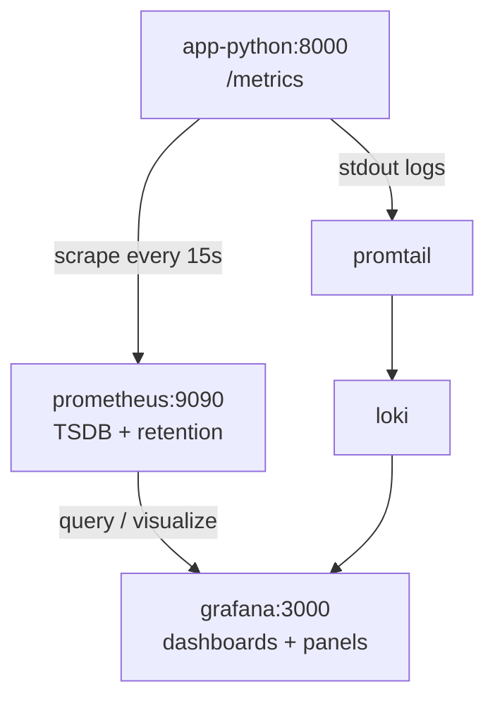
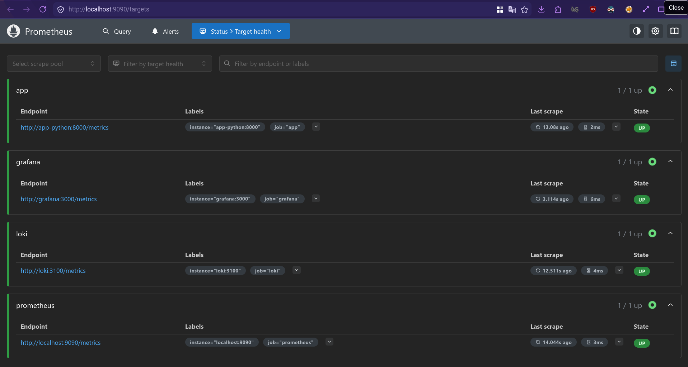
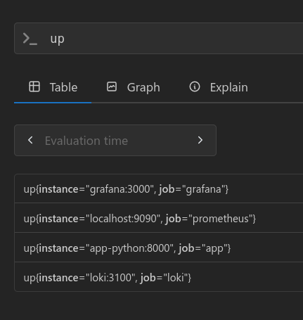
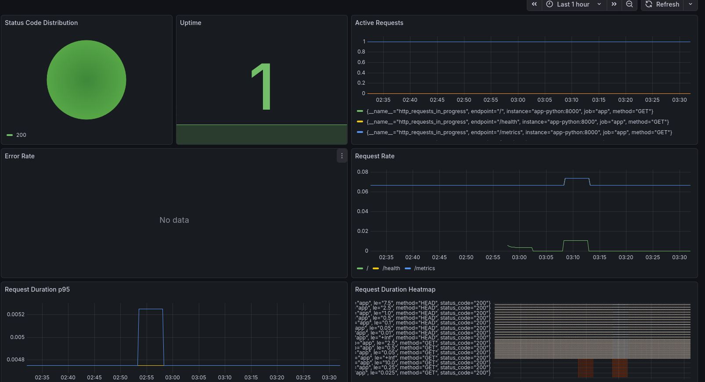

# LAB08 - Metrics and Monitoring

## Task 1 — Application Instrumentation

### Metrics Added

The Python service was instrumented with Prometheus metrics in `app_python/src/metrics.py` and `app_python/src/router.py`.

- `http_requests_total`
  - Counter for total HTTP requests
  - Labels: `method`, `endpoint`, `status_code`
- `http_request_duration_seconds`
  - Histogram for request latency
  - Labels: `method`, `endpoint`, `status_code`
- `http_requests_in_progress`
  - Gauge for active in-flight requests
  - Labels: `method`, `endpoint`
- `devops_info_endpoint_calls_total`
  - Counter for endpoint usage inside the app
  - Labels: `endpoint`
- `devops_info_system_info_duration_seconds`
  - Histogram for the platform-info collection path
  - No labels

### Why These Metrics

The metric set follows the RED method for a request-driven service.

- Rate: `http_requests_total`
- Errors: `http_requests_total{status_code=~"5.."}`
- Duration: `http_request_duration_seconds`

Two extra business-level metrics were added so the dashboard shows something specific to this service rather than only generic HTTP traffic.

### Labeling Choices

- Matched routes use normalized endpoint labels such as `/`, `/health`, and `/metrics`
- Unknown routes are grouped as `endpoint="unmatched"` to keep cardinality low
- The implementation uses `status_code`, not `status`

That last point matters because some of the lab examples use `status`, but this service exports `status_code`.

### Metrics vs Logs

Metrics and logs solve different problems.

- Metrics answer trend questions quickly: request rate, latency, error rate, uptime
- Logs answer forensic questions: which request failed, what stack trace occurred, what client sent the request
- Lab 7 kept Loki + Promtail for logs
- Lab 8 adds Prometheus for numeric time-series monitoring

In practice:

- Use metrics for dashboards, SLO-style views, and alert conditions
- Use logs for debugging after a metric tells you something is wrong

## Task 2 — Prometheus Setup

### Architecture



### Prometheus Configuration

Prometheus was added to the existing monitoring stack in `monitoring/docker-compose.yml` and configured with `monitoring/prometheus/prometheus.yml`.

Current scrape targets:

- `prometheus` -> `localhost:9090`
- `app` -> `app-python:8000/metrics`
- `loki` -> `loki:3100/metrics`
- `grafana` -> `grafana:3000/metrics`

Current scrape/evaluation interval:

- `15s`

### Task 2 Commands Used

```bash
PS1="$ "
cd monitoring
docker compose up -d
docker compose ps | tee /tmp/lab08_task2_compose_ps.txt
curl -fSs http://127.0.0.1:9090/api/v1/targets \
  | jq '{status, data: {activeTargets: [.data.activeTargets[] | {labels, scrapeUrl, lastError, health}]}}' \
  | tee /tmp/lab08_task2_targets_final.json
curl -fSsG --data-urlencode 'query=up' http://127.0.0.1:9090/api/v1/query \
  | jq '{status, data: {resultType: .data.resultType, result: .data.result}}' \
  | tee /tmp/lab08_task2_up_final.json
```

### Task 2 Evidence

Prometheus target screenshot:



PromQL `up` screenshot:



<details>
<summary><code>/api/v1/targets</code> output</summary>

```json
$ curl -fSs http://127.0.0.1:9090/api/v1/targets | jq '{status, data: {activeTargets: [.data.activeTargets[] | {labels, scrapeUrl, lastError, health}]}}' | tee /tmp/lab08_task2_targets_final.json
{
  "status": "success",
  "data": {
    "activeTargets": [
      {
        "labels": {
          "instance": "app-python:8000",
          "job": "app"
        },
        "scrapeUrl": "http://app-python:8000/metrics",
        "lastError": "",
        "health": "up"
      },
      {
        "labels": {
          "instance": "grafana:3000",
          "job": "grafana"
        },
        "scrapeUrl": "http://grafana:3000/metrics",
        "lastError": "",
        "health": "up"
      },
      {
        "labels": {
          "instance": "loki:3100",
          "job": "loki"
        },
        "scrapeUrl": "http://loki:3100/metrics",
        "lastError": "",
        "health": "up"
      },
      {
        "labels": {
          "instance": "localhost:9090",
          "job": "prometheus"
        },
        "scrapeUrl": "http://localhost:9090/metrics",
        "lastError": "",
        "health": "up"
      }
    ]
  }
}
```

</details>

<details>
<summary><code>query=up</code> output</summary>

```json
$ curl -fSsG --data-urlencode 'query=up' http://127.0.0.1:9090/api/v1/query | jq '{status, data: {resultType: .data.resultType, result: .data.result}}' | tee /tmp/lab08_task2_up_final.json
{
  "status": "success",
  "data": {
    "resultType": "vector",
    "result": [
      {
        "metric": {
          "__name__": "up",
          "instance": "grafana:3000",
          "job": "grafana"
        },
        "value": [
          1773967701.736,
          "1"
        ]
      },
      {
        "metric": {
          "__name__": "up",
          "instance": "localhost:9090",
          "job": "prometheus"
        },
        "value": [
          1773967701.736,
          "1"
        ]
      },
      {
        "metric": {
          "__name__": "up",
          "instance": "app-python:8000",
          "job": "app"
        },
        "value": [
          1773967701.736,
          "1"
        ]
      },
      {
        "metric": {
          "__name__": "up",
          "instance": "loki:3100",
          "job": "loki"
        },
        "value": [
          1773967701.736,
          "1"
        ]
      }
    ]
  }
}
```

</details>

## Task 3 — Grafana Dashboards

### Prometheus Data Source

The Prometheus data source was added in Grafana with:

- URL: `http://prometheus:9090`
- access mode: proxy

### Dashboard Walkthrough

The exported dashboard is stored in `monitoring/grafana/dashbboard.json`.

Panels in the current dashboard:

- `Status Code Distribution`
  - Type: `piechart`
  - Query: `sum by (status_code) (rate(http_requests_total[5m]))`
  - Purpose: show 2xx/4xx/5xx mix
- `Uptime`
  - Type: `stat`
  - Query: `up{job="app"}`
  - Purpose: show whether the app is scrapeable
- `Active Requests`
  - Type: `timeseries`
  - Query: `http_requests_in_progress`
  - Purpose: show in-flight request concurrency
- `Error Rate`
  - Type: `timeseries`
  - Query: `sum(rate(http_requests_total{status_code=~"5.."}[5m]))`
  - Purpose: highlight 5xx traffic
- `Request Rate`
  - Type: `timeseries`
  - Query: `sum(rate(http_requests_total[5m])) by (endpoint)`
  - Purpose: show throughput per endpoint
- `Request Duration p95`
  - Type: `timeseries`
  - Query: `histogram_quantile(0.95, rate(http_request_duration_seconds_bucket[5m]))`
  - Purpose: track latency percentile
- `Request Duration Heatmap`
  - Type: `heatmap`
  - Query: `rate(http_request_duration_seconds_bucket[5m])`
  - Purpose: visualize latency distribution

### Task 3 Notes

Two corrections were made to the exported JSON during the final review:

- `status` was replaced with `status_code`
- `Request Duration p95` was corrected from `heatmap` to `timeseries`

These changes align the dashboard with the actual metric schema emitted by the Python app.

### Task 3 Commands Used

```bash
PS1="$ "
cd monitoring
jq '{uid, title, panels: [.panels[] | {title, type, expr: .targets[0].expr}]}' monitoring/grafana/dashbboard.json \
  | tee /tmp/lab08_task3_dashboard_summary.json
curl -fSsG --data-urlencode 'query=http_requests_total' http://127.0.0.1:9090/api/v1/query \
  | jq '{status, data: {resultType: .data.resultType, resultCount: (.data.result | length), result: .data.result[0:4]}}' \
  | tee /tmp/lab08_task3_requests_total.json
```

### Task 3 Evidence

Custom dashboard screenshot:



<details>
<summary><code>dashboard export summary</code> output</summary>

```json
$ jq '{uid, title, panels: [.panels[] | {title, type, expr: .targets[0].expr}]}' monitoring/grafana/dashbboard.json | tee /tmp/lab08_task3_dashboard_summary.json
{
  "uid": "adksq66",
  "title": "Custom",
  "panels": [
    {
      "title": "Status Code Distribution",
      "type": "piechart",
      "expr": "sum by (status_code) (rate(http_requests_total[5m]))"
    },
    {
      "title": "Uptime",
      "type": "stat",
      "expr": "up{job=\"app\"}"
    },
    {
      "title": "Active Requests",
      "type": "timeseries",
      "expr": "http_requests_in_progress"
    },
    {
      "title": "Error Rate",
      "type": "timeseries",
      "expr": "sum(rate(http_requests_total{status_code=~\"5..\"}[5m]))"
    },
    {
      "title": "Request Rate",
      "type": "timeseries",
      "expr": "sum(rate(http_requests_total[5m])) by (endpoint)"
    },
    {
      "title": "Request Duration p95",
      "type": "timeseries",
      "expr": "histogram_quantile(0.95, rate(http_request_duration_seconds_bucket[5m]))"
    },
    {
      "title": "Request Duration Heatmap",
      "type": "heatmap",
      "expr": "rate(http_request_duration_seconds_bucket[5m])"
    }
  ]
}
```

</details>

<details>
<summary><code>http_requests_total</code> query output</summary>

```json
$ curl -fSsG --data-urlencode 'query=http_requests_total' http://127.0.0.1:9090/api/v1/query | jq '{status, data: {resultType: .data.resultType, resultCount: (.data.result | length), result: .data.result[0:4]}}' | tee /tmp/lab08_task3_requests_total.json
{
  "status": "success",
  "data": {
    "resultType": "vector",
    "resultCount": 4,
    "result": [
      {
        "metric": {
          "__name__": "http_requests_total",
          "endpoint": "/health",
          "instance": "app-python:8000",
          "job": "app",
          "method": "GET",
          "status_code": "200"
        },
        "value": [
          1773967701.768,
          "9"
        ]
      },
      {
        "metric": {
          "__name__": "http_requests_total",
          "endpoint": "/metrics",
          "instance": "app-python:8000",
          "job": "app",
          "method": "GET",
          "status_code": "200"
        },
        "value": [
          1773967701.768,
          "8"
        ]
      },
      {
        "metric": {
          "__name__": "http_requests_total",
          "endpoint": "/metrics",
          "instance": "app-python:8000",
          "job": "app",
          "method": "HEAD",
          "status_code": "200"
        },
        "value": [
          1773967701.768,
          "1"
        ]
      },
      {
        "metric": {
          "__name__": "http_requests_total",
          "endpoint": "/",
          "instance": "app-python:8000",
          "job": "app",
          "method": "GET",
          "status_code": "200"
        },
        "value": [
          1773967701.768,
          "5"
        ]
      }
    ]
  }
}
```

</details>

## Task 4 — Production Configuration

### Health Checks

The stack now includes production-style health checks for the services that can reasonably self-test.

- `loki`
  - endpoint: `http://127.0.0.1:3100/ready`
- `grafana`
  - endpoint: `http://127.0.0.1:3000/api/health`
- `prometheus`
  - endpoint: `http://127.0.0.1:9090/-/healthy`
- `promtail`
  - endpoint: `http://127.0.0.1:9080/ready`
  - implemented with `bash` + `/dev/tcp` because this image does not include `wget` or `curl`
- `app-python`
  - endpoint: `http://127.0.0.1:8000/health`
- `app-go`
  - monitored by the existing `app-go-healthcheck` helper container
  - reason: the Go image is built `FROM scratch`, so it cannot run an in-container shell-based HTTP probe

### Resource Limits

Configured limits in `monitoring/docker-compose.yml`:

- Prometheus: `1.0` CPU, `1G` memory
- Loki: `1.0` CPU, `1G` memory
- Grafana: `0.5` CPU, `512M` memory
- app-python: `0.5` CPU, `256M` memory
- app-go: `0.5` CPU, `256M` memory
- Promtail: `0.5` CPU, `256M` memory

### Retention and Persistence

Prometheus retention is enforced through container flags:

- `--storage.tsdb.retention.time=15d`
- `--storage.tsdb.retention.size=10GB`

Persistent volumes in the stack:

- `prometheus-data`
- `loki-data`
- `grafana-data`
- `promtail-data`

### Task 4 Commands Used

```bash
PS1="$ "
cd monitoring
set -a && source .env
curl -fSs -u "$GRAFANA_ADMIN_USER:$GRAFANA_ADMIN_PASSWORD" 'http://127.0.0.1:3000/api/search?query=Custom' \
  | jq '{count: length, dashboards: [.[] | {uid, title, url}]}' \
  | tee /tmp/lab08_task4_grafana_before.json
docker compose down
docker compose up -d
docker compose ps | tee /tmp/lab08_task4_compose_ps_final.txt
curl -fSs -u "$GRAFANA_ADMIN_USER:$GRAFANA_ADMIN_PASSWORD" 'http://127.0.0.1:3000/api/search?query=Custom' \
  | jq '{count: length, dashboards: [.[] | {uid, title, url}]}' \
  | tee /tmp/lab08_task4_grafana_after.json
docker inspect monitoring-prometheus-1 --format '{{json .Config.Healthcheck.Test}} {{json .Config.Cmd}}' \
  | tee /tmp/lab08_task4_prometheus_inspect.txt
```

### Task 4 Evidence

<details>
<summary><code>docker compose ps</code> after restart</summary>

```text
$ docker compose ps | tee /tmp/lab08_task4_compose_ps_final.txt
NAME                              IMAGE                                    COMMAND                  SERVICE              CREATED          STATUS                        PORTS
monitoring-app-go-1               localt0aster/devops-app-go:1.7.9a42ee5   "/devops-info-servic…"   app-go               2 minutes ago    Up 2 minutes                  0.0.0.0:8001->8001/tcp, [::]:8001->8001/tcp
monitoring-app-go-healthcheck-1   curlimages/curl:8.18.0                   "/entrypoint.sh sh -…"   app-go-healthcheck   2 minutes ago    Up 2 minutes (healthy)
monitoring-app-python-1           localt0aster/devops-app-py:1.8.806c77e   "sh -c 'gunicorn --c…"   app-python           2 minutes ago    Up 2 minutes (healthy)        0.0.0.0:8000->8000/tcp, [::]:8000->8000/tcp
monitoring-grafana-1              grafana/grafana:12.3.1                   "/run.sh"                grafana              2 minutes ago    Up About a minute (healthy)   0.0.0.0:3000->3000/tcp, [::]:3000->3000/tcp
monitoring-loki-1                 grafana/loki:3.0.0                       "/usr/bin/loki -conf…"   loki                 2 minutes ago    Up 2 minutes (healthy)        0.0.0.0:3100->3100/tcp, [::]:3100->3100/tcp
monitoring-prometheus-1           prom/prometheus:v3.9.0                   "/bin/prometheus --c…"   prometheus           2 minutes ago    Up 2 minutes (healthy)        0.0.0.0:9090->9090/tcp, [::]:9090->9090/tcp
monitoring-promtail-1             grafana/promtail:3.0.0                   "/usr/bin/promtail -…"   promtail             23 seconds ago   Up 22 seconds (healthy)       0.0.0.0:9080->9080/tcp, [::]:9080->9080/tcp
```

</details>

<details>
<summary><code>Grafana dashboard inventory</code> before restart</summary>

```json
$ curl -fSs -u "$GRAFANA_ADMIN_USER:$GRAFANA_ADMIN_PASSWORD" 'http://127.0.0.1:3000/api/search?query=Custom' | jq '{count: length, dashboards: [.[] | {uid, title, url}]}' | tee /tmp/lab08_task4_grafana_before.json
{
  "count": 2,
  "dashboards": [
    {
      "uid": "adksq66",
      "title": "Custom",
      "url": "/d/adksq66/custom"
    },
    {
      "uid": "adksq661",
      "title": "Custom2",
      "url": "/d/adksq661/custom2"
    }
  ]
}
```

</details>

<details>
<summary><code>Grafana dashboard inventory</code> after restart</summary>

```json
$ curl -fSs -u "$GRAFANA_ADMIN_USER:$GRAFANA_ADMIN_PASSWORD" 'http://127.0.0.1:3000/api/search?query=Custom' | jq '{count: length, dashboards: [.[] | {uid, title, url}]}' | tee /tmp/lab08_task4_grafana_after.json
{
  "count": 2,
  "dashboards": [
    {
      "uid": "adksq66",
      "title": "Custom",
      "url": "/d/adksq66/custom"
    },
    {
      "uid": "adksq661",
      "title": "Custom2",
      "url": "/d/adksq661/custom2"
    }
  ]
}
```

</details>

<details>
<summary><code>Prometheus</code> healthcheck and retention flags</summary>

```text
$ docker inspect monitoring-prometheus-1 --format '{{json .Config.Healthcheck.Test}} {{json .Config.Cmd}}' | tee /tmp/lab08_task4_prometheus_inspect.txt
["CMD-SHELL","wget --no-verbose --tries=1 --spider http://127.0.0.1:9090/-/healthy || exit 1"] ["--config.file=/etc/prometheus/prometheus.yml","--storage.tsdb.retention.time=15d","--storage.tsdb.retention.size=10GB"]
```

</details>

### Persistence Result

Dashboard persistence was confirmed because the same Grafana dashboard UIDs existed before and after `docker compose down` and `docker compose up -d`.

## Task 5 — Final Documentation Pass

### PromQL Examples

The following queries match the actual exported label names:

- `up{job="app"}`
  - Is the Python app currently scrapeable?
- `sum(rate(http_requests_total[5m])) by (endpoint)`
  - Requests per second per endpoint
- `sum(rate(http_requests_total{status_code=~"5.."}[5m]))`
  - 5xx error rate
- `sum by (status_code) (rate(http_requests_total[5m]))`
  - Status-code distribution for the pie chart
- `http_requests_in_progress`
  - Current in-flight requests
- `histogram_quantile(0.95, rate(http_request_duration_seconds_bucket[5m]))`
  - p95 latency estimate
- `devops_info_endpoint_calls_total`
  - App-specific endpoint usage counter

### Testing Results

What was verified during this lab:

- the Python app exposes `/metrics`
- Prometheus scrapes the app, Loki, Grafana, and itself successfully
- Grafana dashboard panels render live Prometheus data
- Prometheus retention flags are applied to the running container
- Grafana dashboards persist across `docker compose down` and `up -d`
- Promtail, Loki, Grafana, Prometheus, and the Python app all report healthy status after the final restart

### Challenges and Solutions

- Challenge: the branch image tag mattered because the older published Python image did not contain the new `/metrics` endpoint
  - Solution: use `localt0aster/devops-app-py:1.8.806c77e`
- Challenge: the lab examples used `status`, while the implemented app uses `status_code`
  - Solution: adapt the Grafana and PromQL queries to `status_code`
- Challenge: the Promtail image does not include `wget` or `curl`
  - Solution: use a `bash` + `/dev/tcp` healthcheck against `/ready`
- Challenge: the Go service is built from `scratch`, so it cannot run a normal in-container HTTP healthcheck
  - Solution: keep the dedicated `app-go-healthcheck` helper container
